# cakecake

仿 B 站核心链路的全栈视频社交平台（用户端品牌 **cakecake**），后端 Go 模块名 `minibili`。

> 项目灵感来源于 [earthcake2233/cakecake](https://github.com/earthcake2233)，在此基础上完成了数据库重构、运营后台全面扩建（84 张数据表，23 个后台模块），形成了可投入生产级使用的完整系统。维护仓库：[PandaGuGu/Copy](https://github.com/PandaGuGu/Copy)。

---

## 系统概述

Cakecake 完整实现了视频分享平台的用户认证、内容管理、实时弹幕、多级评论、社交互动、私信聊天、AI 助手、运营后台等核心功能。主要解决以下问题：

1. **用户身份与内容管理**：注册登录、个人信息维护、视频上传与异步转码（FFmpeg + RabbitMQ + OSS）、专栏发布、个人中心管理。密码 bcrypt 加密，JWT 双 Token（Access 2h + Refresh 7d）。
2. **实时弹幕交互**：WebSocket 长连接，≤200ms 实时推送，Canvas 多轨道渲染，敏感词过滤，弹幕点赞。同一视频房间支持 100 人同时在线。
3. **多级评论系统**：视频 & 文章评论分离，3 级嵌套回复，UP 主管理（精选/关闭/置顶/级联删除），点赞/反对 toggle。
4. **社交互动体系**：关注/取关、拉黑/解除、关注分组、视频收藏夹、稍后再看、投币互动、图文动态发布。
5. **私信与通知系统**：一对一私信（WebSocket 实时推送 + 未读计数）、AI 智能助手对话、点赞聚合通知、评论回复通知、免打扰机制。
6. **硬币经济体系**：每日任务获取硬币、视频/文章投币消费、收支流水账本、经验值等级（Lv1~Lv6）。
7. **运营后台**：23 个模块，覆盖内容审核、运营配置、工单风控、版权管理、数据报表、客服后台、运维监控、配置发布、权限审计。

---

## 技术栈

| 层次 | 技术/组件 | 版本 | 用途 |
|------|-----------|------|------|
| 前端展示层 | Vue 3 + Vite + Element Plus | 3.5+ | SPA 单页应用，路由懒加载 |
| 后端 API 层 | Go + Gin Framework | 1.25 | RESTful API，JWT 鉴权中间件 |
| 数据持久层 | MySQL 8.0 + GORM | 8.0+ | ORM，AutoMigrate 自动建表 |
| 缓存层 | Redis | 7.0+ | 播放计数、弹幕冷却、Refresh Token |
| 消息队列 | RabbitMQ | 3.12+ | 视频转码异步任务队列 |
| 文件存储 | 阿里云 OSS | - | 视频/封面/头像文件存储 |
| 实时通信 | WebSocket（Gorilla） | - | 弹幕推送、私信消息实时送达 |
| 视频处理 | FFmpeg | 7.0+ | H.264 编码转码、封面截帧 |
| 搜索引擎 | Elasticsearch（可选） | 8.15 | 全文搜索、热搜管理 |
| AI 集成 | 可以任意 API | - | AI 智能助手对话 |
| 鉴权机制 | JWT 双 Token | - | Access（2h）+ Refresh（7d） |

---

## 数据库设计

系统基于 MySQL 8.0 InnoDB（utf8mb4），GORM AutoMigrate 首次启动自动建表，共计 **84 张数据表**，按 15 个业务模块组织。

### 数据库架构总览

<table>
  <tr>
    <td align="center"><b>核心模块（upper）</b><br>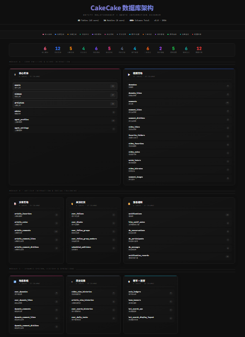</td>
  </tr>
  <tr>
    <td align="center"><b>扩展模块（lower）</b><br>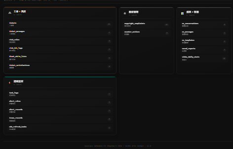</td>
  </tr>
</table>

### E-R 图

| E-R 图 | 说明 |
|--------|------|
| 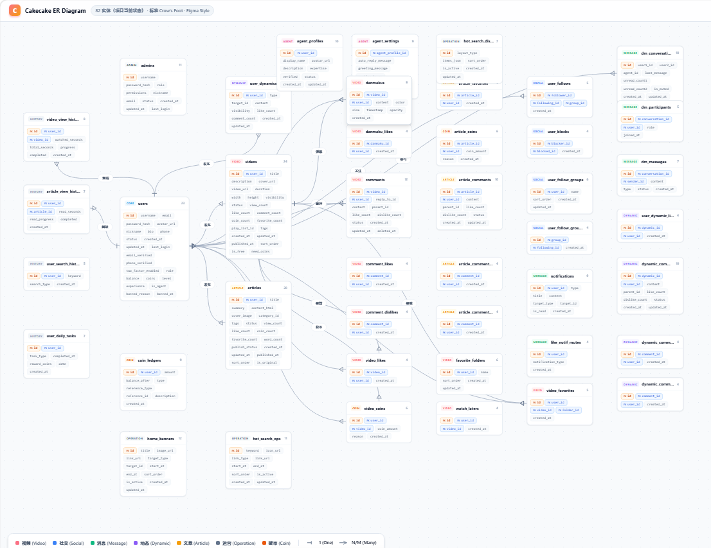 | **84 实体 · Crow's Foot 标注 · Figma 风格** — [交互版](docs/cakecake_er_figma-diagram.html) |
| 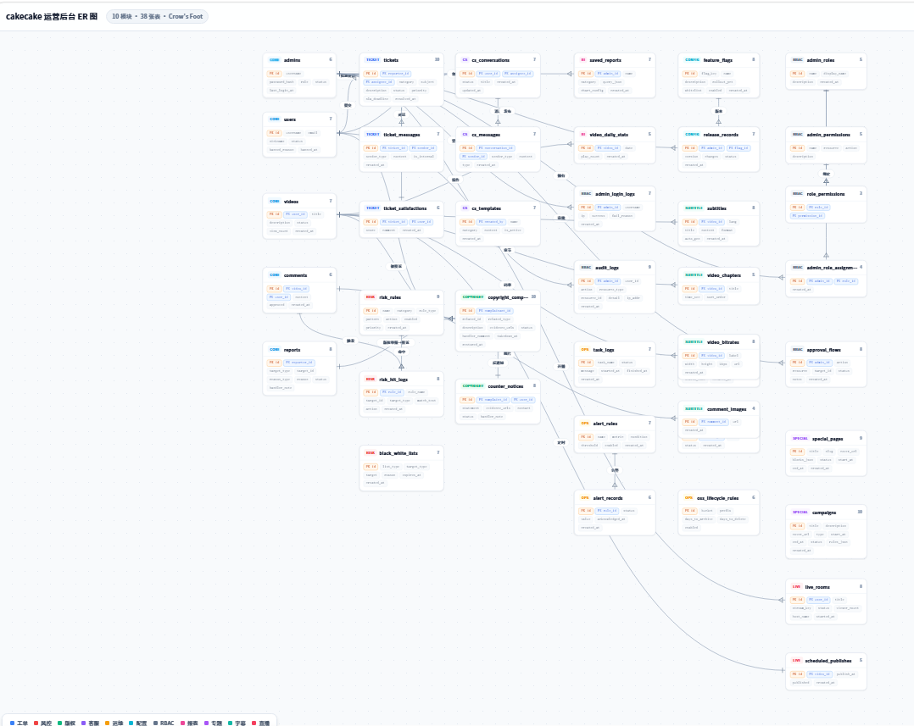 | Admin Extensions 扩展模块 ER（工单/风控/版权/运维/配置权限等 39 张表） — [交互版](docs/AdminER_Diagram.html) |
| [cakecake_er_bento.html](docs/cakecake_er_bento.html) | **Bento 风格** 数据库架构总览（84 实体 / 15 模块） |

### 核心实体（6 张）

| 表名 | 中文名 | 字段数 | 说明 |
|------|--------|--------|------|
| `users` | 用户表 | 23 | JWT 双 Token、bcrypt 密码、经验值等级（Lv1~Lv6）、硬币余额、注销冷静期 |
| `videos` | 视频表 | 29 | H.264 转码状态机（draft→processing→published/failed）、Redis 播放计数 10s 落库 |
| `articles` | 专栏文章表 | 20 | Markdown 正文、标签 JSON、投币/收藏/转发计数 |
| `danmakus` | 弹幕表 | 10 | WebSocket 实时推送、5s 冷却 + 敏感词过滤、scroll/top/bottom 模式 |
| `comments` | 视频评论表 | 12 | 3 级嵌套（parent_id 自引用 + level 字段）、精选模式审核、点赞反对 toggle |
| `admins` | 管理员表 | 8 | 独立 JWT 登录运营后台，与普通用户体系分离 |

### 业务模块表分布

| 模块 | 表数 | 包含表 |
|------|------|--------|
| 视频互动 | 10 | `danmakus`, `comments`, `comment_likes`, `comment_dislikes`, `video_likes`, `video_coins`, `video_favorites`, `favorite_folders`, `watch_laters`, `danmaku_likes` |
| 文章互动 | 5 | `articles`, `article_comments`, `article_favorites`, `article_coins`, `a_comment_likes`, `a_comment_dislikes` |
| 关注社交 | 4 | `user_follows`, `user_blocks`, `user_follow_groups`, `u_follow_group_members` |
| 消息通知 | 5 | `dm_conversations`, `dm_messages`, `dm_participants`, `notifications`, `like_notif_mutes` |
| 动态系统 | 5 | `user_dynamics`, `user_dynamic_likes`, `dynamic_comments`, `d_comment_likes`, `d_comment_dislikes` |
| 历史记录 | 5 | `video_view_histories`, `article_view_histories`, `live_view_histories`, `user_search_histories`, `user_daily_tasks` |
| 运营基础 | 6 | `coin_ledgers`, `agent_profiles`, `agent_settings`, `home_banners`, `hot_search_ops`, `hot_search_display_layout` |
| 工单风控 | 6 | `tickets`, `ticket_messages`, `ticket_satisfactions`, `risk_rules`, `risk_hit_logs`, `black_white_lists` |
| 版权管理 | 2 | `copyright_complaints`, `counter_notices` |
| 数据报表 | 2 | `saved_reports`, `video_daily_stats` |
| 客服后台 | 3 | `cs_templates`, `cs_conversations`, `cs_messages` |
| 运维监控 | 6 | `task_logs`, `alert_rules`, `alert_records`, `trace_records`, `cdn_refresh_tasks`, `oss_lifecycle_rules` |
| 配置权限 | 12 | `feature_flags`, `release_records`, `admin_roles`, `admin_permissions`, `role_permissions`, `admin_role_assignments`, `admin_login_logs`, `audit_logs`, `approval_flows`, `approval_steps`, `special_pages`, `campaigns` |

### 关键索引设计

| 表 | 索引类型 | 字段 | 作用 |
|----|----------|------|------|
| `users` | UNIQUE | `username` | 登录名全局唯一 |
| `videos` | INDEX | `user_id`, `status`, `play_count`, `created_at` | 多维度查询排序 |
| `video_likes` | UNIQUE | `(user_id, video_id)` | 每用户每视频限赞一次 |
| `video_coins` | UNIQUE | `(user_id, video_id)` | 每用户每视频限投币一次 |
| `video_favorites` | UNIQUE | `(user_id, video_id, folder_id)` | 同视频可放多收藏夹 |
| `user_follows` | UNIQUE | `(follower_id, followee_id)` | 防重复关注 |
| `dm_conversations` | UNIQUE | `(user_low, user_high)` | 两人对话唯一 |
| `video_view_histories` | UNIQUE | `(user_id, video_id)` | 每用户每视频一条记录 |
| `live_view_histories` | UNIQUE | `(user_id, live_room_id)` | 每用户每直播房间一条记录 |
| `feature_flags` | UNIQUE | `flag_key` | 功能开关标识唯一 |
| `audit_logs` | INDEX | `(admin_id, created_at)`, `(resource_type, resource_id)` | 审计追溯 |

### 用户角色与权限矩阵

| 操作 | 普通用户 | UP 主 | 管理员 | AI 助手 |
|------|:--:|:--:|:--:|:--:|
| 浏览视频/文章 | ✓ | ✓ | ✓ | ✗ |
| 上传视频/文章 | ✓ | ✓ | ✗ | ✗ |
| 发送弹幕 | ✓ | ✓ | ✓ | ✗ |
| 发表评论 | ✓ | ✓ | ✓ | ✗ |
| 点赞/投币/收藏 | ✓ | ✓ | ✓ | ✗ |
| 关注/拉黑 | ✓ | ✓ | ✓ | ✗ |
| 发送私信 | ✓ | ✓ | ✓ | ✓ |
| 删除他人评论 | ✗ | ✓（自己视频下） | ✓ | ✗ |
| 审核视频/文章 | ✗ | ✗ | ✓ | ✗ |
| 运营配置 | ✗ | ✗ | ✓ | ✗ |
| AI 对话 | ✓ | ✓ | ✓ | ✓（接受） |

---

## 功能模块总览

系统涵盖用户管理、内容管理、实时互动、社交网络和运营管理五大领域：

| 子系统 | 核心能力 |
|--------|----------|
| 用户认证 | 注册（唯一性校验）→ 登录（JWT 双 Token）→ 密码修改 → 个人信息维护 → 账号注销（7 天冷静期） |
| 视频管理 | 上传（≤500MB, ≤30min）→ 异步转码（FFmpeg→H.264 MP4→OSS）→ 状态机 → Redis 播放计数 |
| 弹幕系统 | WebSocket 长连接 → 历史弹幕推送（最近 200 条）→ 5s 冷却 + 敏感词过滤 → Canvas 多轨道渲染 |
| 评论系统 | 视频/文章独立表 → 3 级嵌套 → UP 主管理（精选/关闭/置顶）→ 点赞反对 toggle → 聚合通知 |
| 社交互动 | 关注/取关 → 拉黑（双向互阻）→ 关注分组 → 多收藏夹 → 投币（coin_ledgers）→ 动态发布 |
| 私信聊天 | 一对一配对 → WebSocket 实时推送 → 未读计数 → 置顶/免打扰 → AI 对话（DeepSeek） |
| 通知系统 | 点赞聚合通知 → 评论回复通知 → 消息中心 5 分类 → 未读角标 → 免打扰 |
| 搜索模块 | ES 全文搜索 → 搜索历史 → 观看/阅读/直播历史追踪 → 中途续播进度追踪 → 每日任务 |
| 直播系统 | 创建/设置直播间 → SRS 回调推流 → flv.js 播放 → WebSocket 实时聊天+礼物 → 观众追踪 → 直播历史记录 |
| 运营后台 | 参见下方运营后台章节（23 个模块） |

---

## 运营后台（23 模块）

| # | 模块 | 功能 |
|---|------|------|
| 1 | 数据概览 | 9 张概览卡片（用户/视频/文章/评论/播放/弹幕等） |
| 2 | 首页轮播 | 横幅 CRUD + 排序 + 起止时间 |
| 3 | 热搜运营 | 关键词 pin/block/manual 干预 + 布局排序 |
| 4 | 用户管理 | 用户列表、封禁、信息编辑 |
| 5 | 视频审核 | 审核 publish/reject → 记录审核人 + 时间 |
| 6 | 专栏审核 | 文章内容审核 |
| 7 | 动态管理 | 动态列表与删除 |
| 8 | 评论管理 | 跨 3 表联合查询（视频/文章/动态评论） |
| 9 | 系统设置 | 全局配置管理，同步更新 .env + 内存 |
| 10 | 举报处理 | 举报受理与处理流程 |
| 11 | AI 角色 | Agent Profile CRUD + 提示词 + 欢迎语 |
| 12 | 工单管理 | 用户提交→处理→对话记录→满意度评价 |
| 13 | 风控管理 | 风险规则 + 黑白名单 + 命中日志（IP/设备/行为） |
| 14 | 版权管理 | 投诉→审核→下架/驳回 + 反通知机制 |
| 15 | 数据报表 | 播放统计 + 报表配置保存 + CSV/JSON 多格式导出 |
| 16 | 客服后台 | 模板管理 + 会话管理 + 快捷回复 |
| 17 | 运维监控 | 任务队列/告警/链路追踪/健康检查/CDN/存储生命周期 |
| 18 | 配置发布 | 功能开关（FNV-1a Hash 灰度）+ 版本发布（快照→部署→回滚） |
| 19 | 权限审计 | RBAC 角色/权限点 → 审计日志 → 审批流 → 登录日志 |

---

## 仓库结构

```
Minibili/                      # 仓库根
├── cmd/mini-bili/             # Go 入口
├── internal/                  # handler / service / worker / ws / model …
├── configs/                   # sensitive_words.txt
├── deploy/                    # Nginx、systemd 模板
├── docs/                      # 截图、ER 图、部署手册
├── scripts/                   # 工具脚本
├── go.mod                     # module minibili
└── cakecake-vue/
    └── bilibili-vue/          # Vue 3 + Vite 前端（独立 go.mod 隔离）
```

---

## 5 分钟本地联调

### 1. 后端（仓库根目录）

```bash
cp .env.example .env          # 填写 JWT_SECRET、MYSQL_DSN、REDIS_*、RABBITMQ_URL、OSS_* 等
go mod tidy
go build -o ./bin/mini-bili ./cmd/mini-bili/
./bin/mini-bili               # 默认 :8080；健康检查 GET /api/v1/health
```

MySQL 需先建库（如 `minibili`）；**表由首次启动时 GORM AutoMigrate 自动创建**（84 张表，含全部索引与约束），无需手动执行 SQL。

### 2. 前端

```bash
cd cakecake-vue/bilibili-vue
npm install
cp .env.example .env.local    # 至少 VITE_MINIBILI_API=true
npm run dev                   # http://localhost:8888
```

### 3. 验证

- 首页能打开，接口走 `/api/v1`（Vite 代理到 `127.0.0.1:8080`）
- 登录 / 注册：`#/minibili/login`、`#/minibili/register`
- 无效路径或不存在的视频 → `#/404`

前端细节、环境变量说明见 **[bilibili-vue/README.md](./cakecake-vue/bilibili-vue/README.md)**。

---

## 环境依赖

| 组件 | 用途 |
|------|------|
| **Go** 1.22+（`go.mod` 当前 1.25） | 后端 |
| **Node.js** + **npm** | 前端（请用 npm，勿与 yarn 混用锁文件） |
| **MySQL** 8.0+ | 持久化（字符集 utf8mb4，InnoDB） |
| **Redis** 7.x | 播放计数、弹幕冷却、Refresh Token |
| **RabbitMQ** 3.12+ | 转码队列 |
| **Elasticsearch** 8.x（可选） | 全文搜索；未配置则搜索页提示未就绪 |
| **FFmpeg / ffprobe** 7.0+ | 转码与封面截帧；Windows 建议 .env 设绝对路径 |
| **阿里云 OSS** | `videos/`、`covers/`、`avatars/` 等 |

---

## 后端配置要点

复制 [`.env.example`](./.env.example) → `.env`，至少配置：

- `JWT_SECRET`、`MYSQL_DSN`
- `REDIS_*`、`RABBITMQ_URL`
- `OSS_*`（Endpoint、AccessKey、Bucket）
- `SENSITIVE_WORDS_FILE`（缺失时弹幕拒绝发送）
- `TEMP_UPLOAD_DIR`（可写临时目录）
- `ELASTICSEARCH_*`（可选）
- `VIDEO_UPLOAD_DISABLED`（可选，`true` 时关闭网页端视频文件上传）
- `FFPROBE_PATH` / `FFMPEG_PATH`（Windows 建议设置绝对路径）

### Air 热重载（可选）

```bash
go install github.com/air-verse/air@latest
air    # 在仓库根执行；见 .air.toml，会加载 .env
```

---

## HTTP API 约定

- 前缀：`/api/v1`
- 响应：`{ "code": number, "msg": string, "data": object | null }`（Rule **R-API-1**）
- 写操作与 WebSocket：`Authorization: Bearer <access_token>`
- 运营后台：`/api/admin/*`，独立 admin JWT

完整路由以 **SPEC.md** 为准。

---

## 数据流图

<table>
  <tr>
    <td align="center"><b>Context Diagram（顶层）</b><br>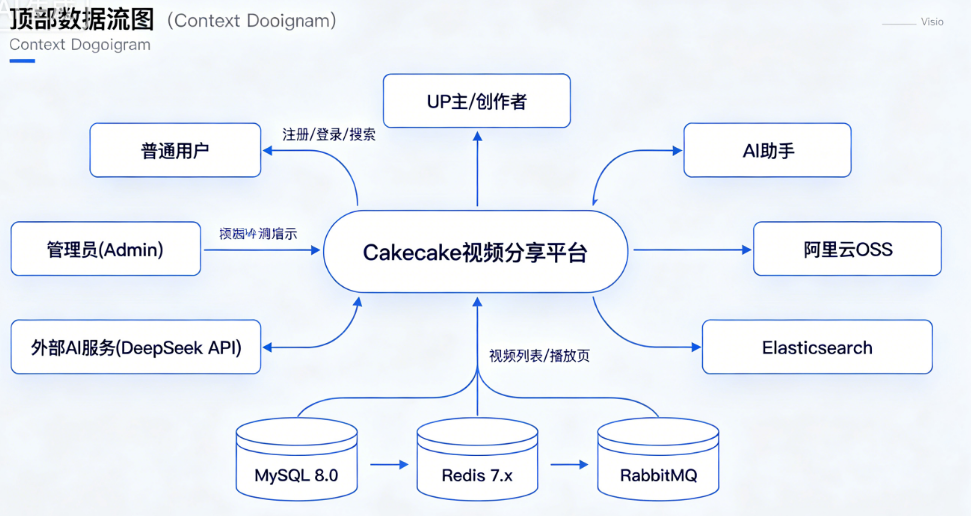</td>
    <td align="center"><b>Level-0 FFD（分解）</b><br>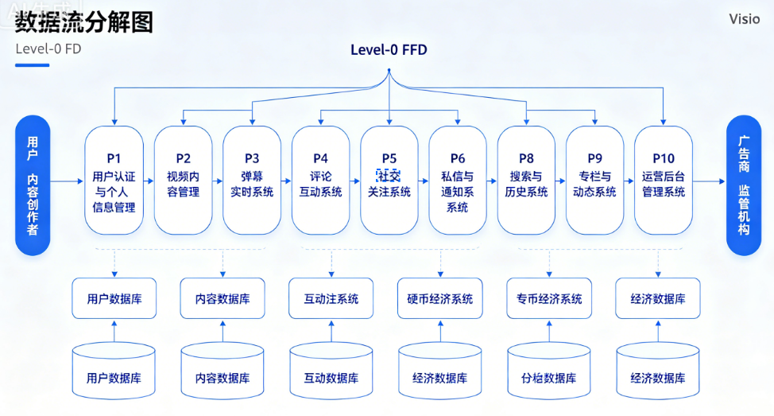</td>
  </tr>
</table>

---

## 数据流概要

### 视频上传与转码

```
用户 → multipart上传 → 校验大小/时长 → INSERT videos(status=processing)
→ 投递 RabbitMQ → Worker 消费 → FFmpeg 转码(H.264 MP4) 
→ 上传 OSS → UPDATE video_url/status → 清理临时文件
```

### 弹幕实时推送

```
用户 → WebSocket连接 → 发送弹幕 → 校验(鉴权+5s冷却+敏感词)
→ INSERT danmakus → 广播至房间所有 WebSocket → Canvas 渲染
```

### 私信发送

```
用户 → 发送消息 → 查找/创建对话 → INSERT dm_messages
→ WebSocket 推送对端 → UPDATE dm_participants.unread_count
```

### 硬币投币（事务）

```
INSERT video_coins → UPDATE users.coin_balance → INSERT coin_ledgers
```

---

## 运营后台权限架构

权限校验分三层：

1. **中间件层**：`authMiddleware` 从 Authorization Header 提取 JWT → 注入 `user_id` 到 Context；`adminAuthMiddleware` 独立校验 admin Token。
2. **Handler 层**：业务操作中比对 `user_id` 和资源 `owner_id`（如删除评论时检查是否为 UP 主或本人）。
3. **数据层**：复合唯一索引防重复操作，外键约束保证引用一致性。
4. **审计层**：所有写操作自动记录 `audit_logs`（操作人、类型、目标资源、结果、IP）。

---

## 测试

```bash
go test ./... -count=1

# 对已部署服务的黑盒（未设 URL 则 Skip）
# PowerShell: $env:MINIBILI_TEST_BASE_URL="http://127.0.0.1:8080"
go test -tags=integration ./internal/handler/... -count=1
```

---

## 生产部署

见 **[deploy/DEPLOY.md](./deploy/DEPLOY.md)**（静态资源目录常为 `/opt/minibili/www`）。可选 **[GitHub Actions](./.github/workflows/deploy.yml)** 在 push 到 `main` 时自动构建并 SSH 部署（Secrets 见 workflow 注释）。

---

## 界面截图

<table>
  <tr>
    <td align="center"><b>首页</b><br>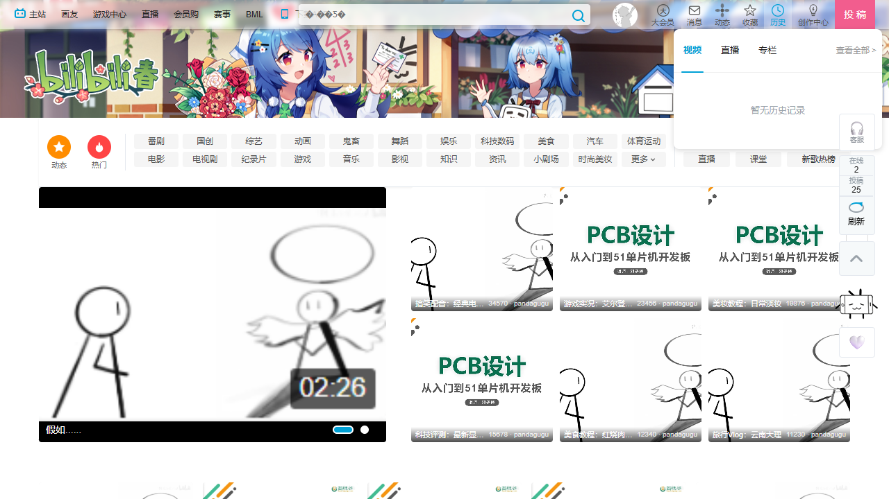</td>
    <td align="center"><b>视频播放（含弹幕）</b><br></td>
  </tr>
  <tr>
    <td align="center"><b>搜索</b><br></td>
    <td align="center"><b>个人中心</b><br></td>
  </tr>
  <tr>
    <td align="center"><b>个人空间</b><br></td>
    <td align="center"><b>动态</b><br></td>
  </tr>
  <tr>
    <td align="center"><b>排行榜</b><br></td>
    <td align="center"><b>运营后台 BI</b><br>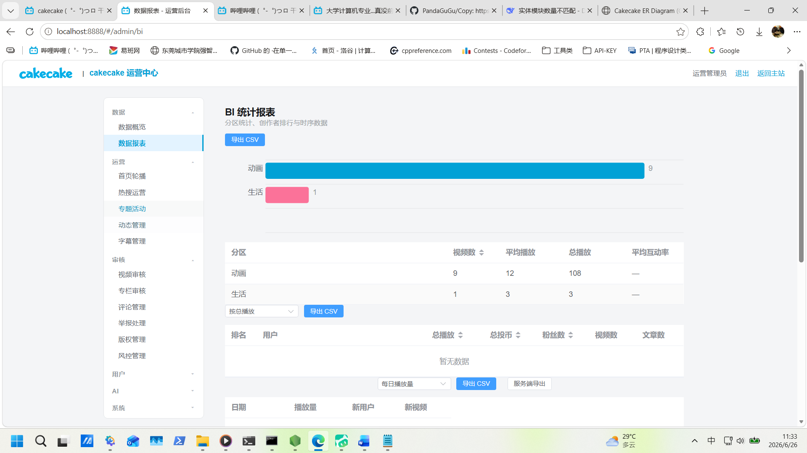</td>
  </tr>
  <tr>
    <td align="center"><b>历史记录页（B站风格顶部栏）</b><br>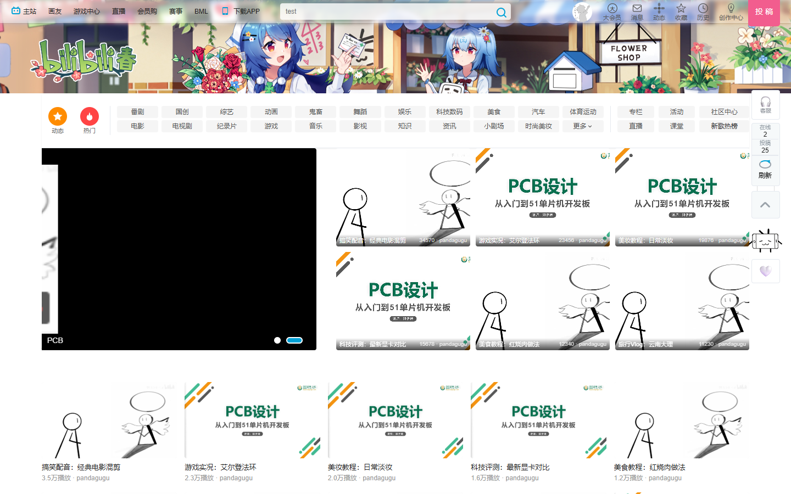</td>
    <td align="center"><b>首页导航 · 历史悬浮窗</b><br>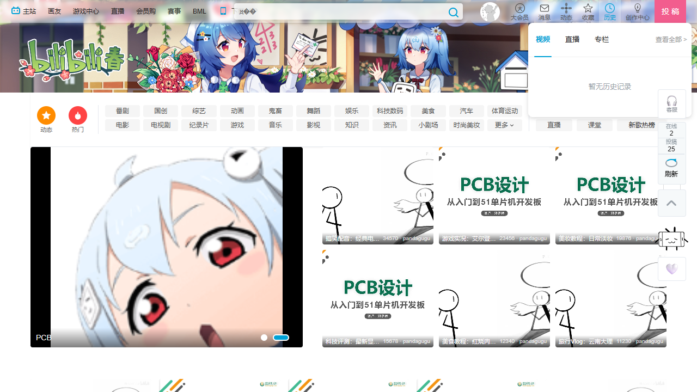</td>
  </tr>
  <tr>
    <td align="center"><b>直播广场</b><br>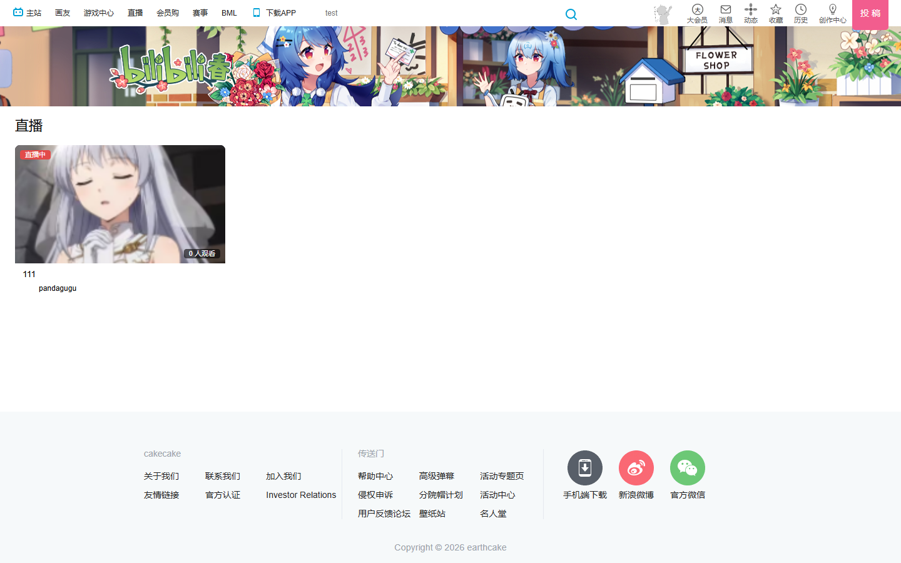</td>
    <td align="center"><b>直播间（弹幕 + 礼物 + 聊天）</b><br></td>
  </tr>
</table>

---

## 文档索引

| 文档 | 读者 | 说明 |
|------|------|------|
| **本文** | 全栈 / 后端 | 项目概述、数据库设计、环境、启动、API 约定 |
| [cakecake-vue/bilibili-vue/README.md](./cakecake-vue/bilibili-vue/README.md) | 前端 | 安装、环境变量、开发 / 构建 |
| [deploy/DEPLOY.md](./deploy/DEPLOY.md) | 运维 | 生产部署（Nginx、systemd、OSS、ES） |
| [docs/manual-video-ingest.md](./docs/manual-video-ingest.md) | 运维 | 关闭网页上传时，本地 OSS + 手动写库发视频 |
| [docs/ai-gateway.md](./docs/ai-gateway.md) | 运维 | AI 助手（DeepSeek）配置 |
| [docs/cakecake_er_figma-diagram.html](./docs/cakecake_er_figma-diagram.html) | 开发 | 完整 ER 图（84 实体，Crow's Foot 标注） — 交互版 |
| [docs/AdminER_Diagram.html](./docs/AdminER_Diagram.html) | 开发 | 扩展模块 ER 图（39 表） — 交互版 |
| [docs/cakecake_er_bento.html](./docs/cakecake_er_bento.html) | 开发 | Bento 风格 数据库架构总览（84 实体 / 15 模块） |
| [SPEC.md](./SPEC.md) | 开发 | 功能与验收规格 |
| [Rule.md](./Rule.md) | 开发 | 工程红线 |
| [Skill.md](./Skill.md) | 开发 | 标准操作（迁移、Token、WS 等） |

---

## 其他

- 勿提交 `.env`、密钥与数据库密码。
- 实现与 SPEC / Rule 冲突时，以 SPEC / Rule 为准。
- 后端基于 [earthcake2233/cakecake](https://github.com/earthcake2233) 开源项目二次开发，遵循开源协议。
