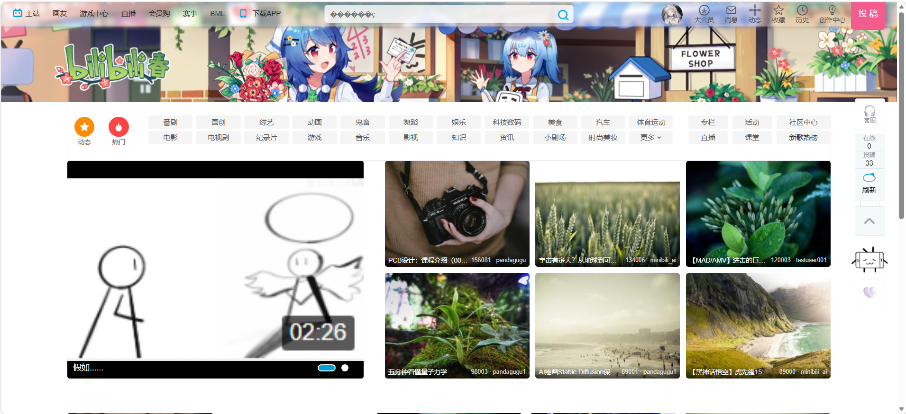
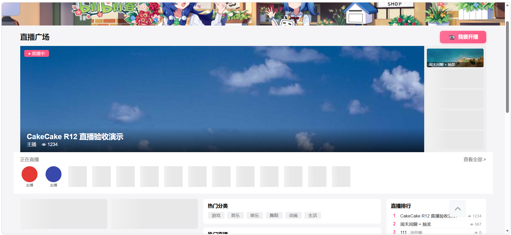
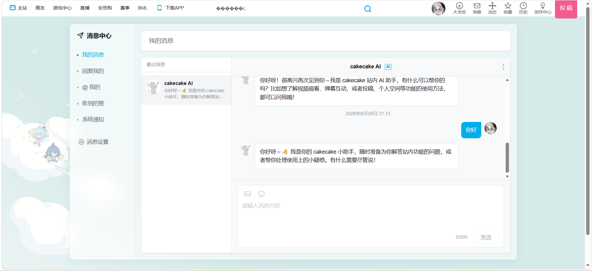
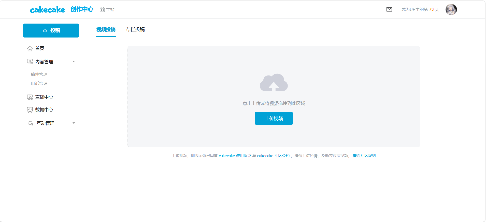
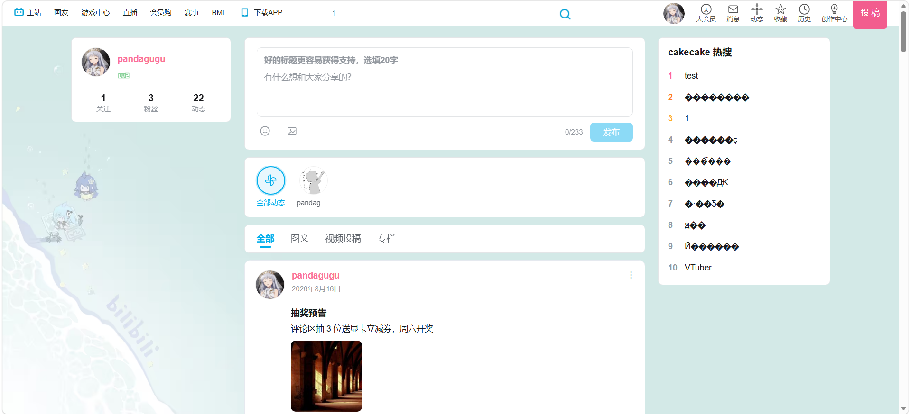
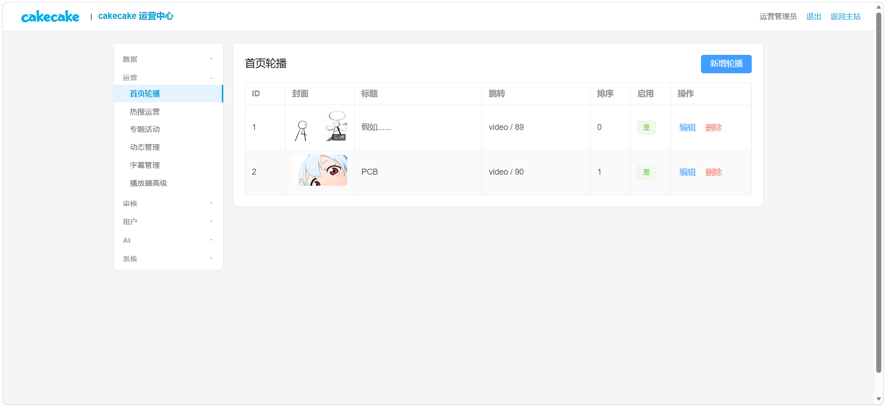
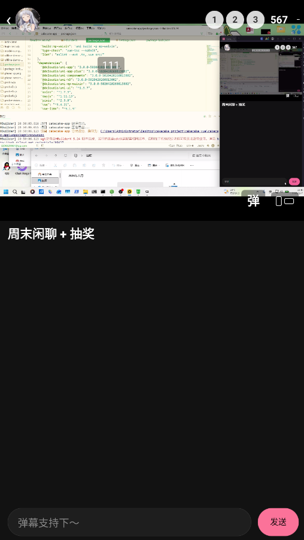
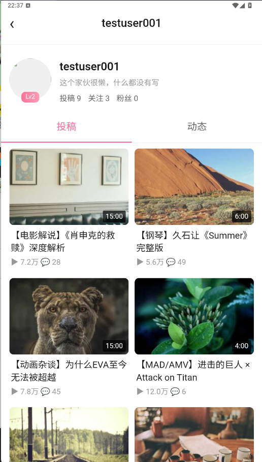
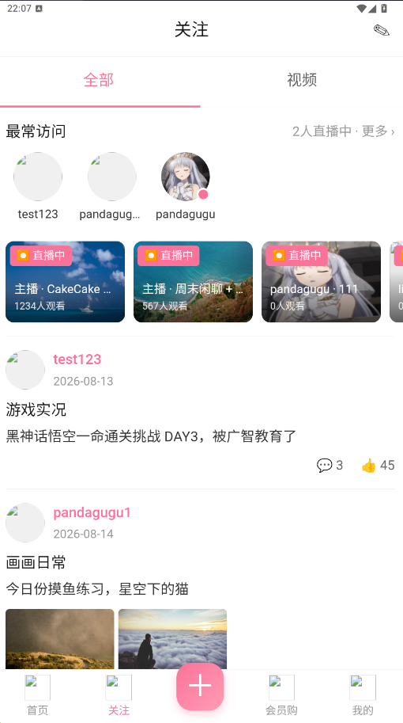
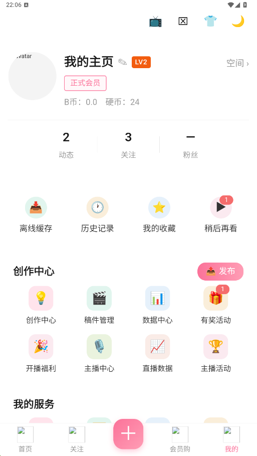

# cakecake

<p align="center">
  <b>仿 B 站的全栈视频社交平台</b><br>
  <sub>视频上传/异步转码 · 弹幕 WebSocket · 直播 SRS · 评论/私信/硬币 · 23 模块运营后台 · Docker 一键部署</sub>
</p>

<p align="center">
  <a href="#docker-一键部署"></a>
  
  
  
  
  
  
</p>

仿 B 站核心链路的全栈视频社交平台（用户端品牌 **cakecake**），后端 Go 模块名 `minibili`。

> 项目灵感来源于 [earthcake2233/cakecake](https://github.com/earthcake2233/cakecake)，在此基础上完成数据库重构与运营后台全面扩建（88 张表、23 个后台模块、23 种 RBAC 权限码）。维护仓库：[PandaGuGu/Copy](https://github.com/PandaGuGu/Copy)。

---

## 系统概述

| 子系统 | 核心能力 |
|--------|----------|
| 用户认证 | 注册 → 登录（JWT 双 Token）→ 密码修改 → 账号注销（7 天冷静期） |
| 视频 | 上传（≤500MB, ≤30min）→ 异步转码（FFmpeg + RabbitMQ → H.264/OSS）→ 状态机 |
| 弹幕 | WebSocket 长连接 → 历史弹幕 → 5s 冷却 + 敏感词过滤 |
| 评论/文章/动态 | 三套独立表 · 3 级嵌套 · UP 主管理 · 点赞/投币/收藏 |
| 社交 | 关注/拉黑/分组 · 私信（WS 实时）· 通知聚合 · 硬币账本 |
| 搜索/推荐 | ES 全文搜索（可选）· 协同过滤 + MMR 重排序 |
| 直播 | SRS RTMP 推流 → HTTP-FLV 播放 · WS 聊天 + 礼物 |
| 移动端 App | uni-app（Vue3 + TS + Pinia）· 19 页面 · 复用后端 180+ API（见 [docs/APP.md](./docs/APP.md)） |
| 运营后台 | 23 模块全前后端对齐，RBAC 权限控制（见下） |

架构细节、数据流图、算法详述见 [bmad-output/architecture.md](./bmad-output/architecture.md)。

---

## 技术栈

| 层次 | 技术 |
|------|------|
| 前端 | Vue 3 + Vite + Element Plus + ECharts（SPA，路由懒加载） |
| 后端 | Go 1.25 + Gin + GORM（200+ 源文件，分层 handler/service/model/data） |
| 存储 | MySQL 8（88 表，GORM AutoMigrate 自动建表）· Redis 7（播放计数/冷却/黑名单） |
| 中间件 | RabbitMQ（转码队列）· WebSocket（gorilla，弹幕/私信/直播 3 通道） |
| 直播/视频 | SRS 5 + flv.js · FFmpeg 7（H.264 转码） |
| 移动端 | uni-app + Vue3 + TS + Pinia（`cakecake-vue/cakecake-app/`，复用后端 API） |

---

## 快速开始

### 本地联调

```bash
# 1. 后端（默认 :8080）
cp .env.example .env          # 填 JWT_SECRET、MYSQL_DSN、REDIS_*、RABBITMQ_URL 等
go mod tidy && go build -o ./bin/mini-bili ./cmd/mini-bili/
./bin/mini-bili               # 健康检查 GET /api/v1/health

# 2. 前端（http://localhost:8888）
cd cakecake-vue/bilibili-vue
npm install && cp .env.example .env.local && npm run dev

# 3. 移动端 H5（默认 5173）
cd cakecake-vue/cakecake-app && npm install && npm run dev:h5
```

MySQL 需先建库（如 `minibili`），**表由首次启动时 AutoMigrate 自动创建**，无需手动执行 SQL。

### Docker 一键部署

```bash
cd cakecake-vue/bilibili-vue && npm install && npm run build && cd ../..
cp .env.example .env          # 只需设置 JWT_SECRET，其余留空即可
docker compose up -d          # 访问 http://localhost，管理员 admin / change-me-admin
```

| 服务 | 端口 | 说明 |
|------|------|------|
| 前端 Nginx | 80 | SPA + API 反代 + WebSocket 代理 |
| Go 后端 | 8080 | REST API + WebSocket |
| MySQL / Redis / RabbitMQ | 3306 / 6379 / 5672 | 数据库 / 缓存 / 转码队列 |
| SRS | 1935 / 8000 | RTMP 推流 / HTTP-FLV 播放 |

文件存储默认本地卷（`uploads_data`），配置 `OSS_*` 后自动切换阿里云 OSS，**无需云存储即可完整运行**。ES 为可选组件，默认不启动。

---

## 运营后台（23 模块）

数据概览、首页轮播、热搜运营、用户管理、视频审核、专栏审核、动态管理、评论管理、系统设置、举报处理、AI 角色、工单管理、风控管理、版权管理、数据报表、客服后台、运维监控、配置发布（Feature Flag 灰度）、权限审计（RBAC）、播放器高级、字幕管理、评论增强、Feed 推荐。

> 完整 API 文档（400+ 端点、权限码索引、WS 协议）见 [docs/API.md](./docs/API.md)。

---

## 数据库

88 张表、15 个业务模块（视频/文章/动态/关注/私信/通知/直播/历史/风控/工单/版权/报表/客服/运维/配置），AutoMigrate 首次启动自动建表。

- [ER 图（完整版）](docs/images/er-diagram-full.png) · [交互版](docs/cakecake_er_figma-diagram.html)
- [Bento 架构总览](docs/cakecake_er_bento.html) · [扩展模块 ER](docs/AdminER_Diagram.html)

核心表：`users`（23 字段）、`videos`（29 字段，转码状态机）、`articles`、`danmakus`、`comments`、`admins`。

---

## 仓库结构

```
├── cmd/mini-bili/          # Go 入口
├── internal/
│   ├── handler/            # 90 个 handler（含 25 个 admin）
│   ├── service/            # 业务逻辑层（21 文件）
│   ├── model/              # 88 个 GORM 模型
│   ├── data/               # 数据层（AutoMigrate + seed）
│   ├── worker/             # RabbitMQ 消费者 / 定时任务
│   ├── ws/                 # WebSocket Hub（弹幕/私信/直播）
│   └── middleware/ aigateway/ search/ storage/ ffmpeg/ ...
├── cakecake-vue/
│   ├── bilibili-vue/       # PC 端前端（Vue 3 + Vite）
│   └── cakecake-app/       # 移动端 App（uni-app，见 docs/APP.md）
├── docs/                   # API 文档、ER 图、截图、部署手册
├── deploy/                 # Nginx / systemd / compose 模板
├── configs/                # 敏感词库等
├── scripts/                # 工具脚本
├── bmad-output/            # 架构分析
└── Rule.md / SPEC.md / Skill.md   # 研发制度 / 需求规格 / 操作手册
```

---

## HTTP API 约定

- 前缀 `/api/v1`，响应 `{ "code": number, "msg": string, "data": object|null }`
- 认证 `Authorization: Bearer <access_token>`；WebSocket 连接带 `?token=`
- 运营后台 `/api/admin/*`，独立 admin JWT + 23 权限码

---

## 界面截图

**PC 端**

| 首页 | 直播广场 | 直播间 | 消息 |
|------|------|------|------|
|  |  |  |  |

| 个人主页 | 创作中心 | 动态 | 后台管理 |
|------|------|------|------|
|  |  |  |  |

**移动端 App**

| 首页 | 直播间 | 消息 | 个人空间 |
|------|------|------|------|
|  |  |  |  |

| 关注页面 | 我的页面 |
|------|------|
|  |  |

---

## 测试

### 后端（Go test）

```bash
go test ./... -count=1       # 单元测试：SQLite 内存库 + miniredis，无外部依赖
go test -cover ./... -count=1 # 覆盖率
```

单元测试覆盖 `internal/{handler,service,ws,model,pkg}/...` 等核心模块（当前 `internal/handler` 部分用例依赖测试库初始化，需要 `trace_records` 等表已建，否则 trace 中间件会空指针 panic 而失败）。

### 前端（Vitest / Vue）

```bash
cd cakecake-vue/bilibili-vue && npm test          # 前端单元测试（如配置）
cd cakecake-vue/cakecake-app && npm run type-check # 移动端类型检查
```

### 性能压测（压测脚本工具）

```bash
go run ./scripts/bench        # 压测脚本（需先启动后端，见 bench.go）
```

压测思路参考上游 [earthcake2233/cakecake](https://github.com/earthcake2233/cakecake)：用仓库内 `go test -cover` 统计覆盖、用独立压测脚本对目标接口并发高压并配合 pprof 定位瓶颈（系统调用 / GORM-MySQL 查询链 / JSON 序列化）。

---

## 文档索引

| 文档 | 内容 |
|------|------|
| [docs/API.md](./docs/API.md) | 完整 API 文档（400+ 端点、权限码、WS 协议） |
| [bmad-output/architecture.md](./bmad-output/architecture.md) | 架构分析（ADR、数据流、算法） |
| [SPEC.md](./SPEC.md) / [Rule.md](./Rule.md) / [Skill.md](./Skill.md) | 需求规格 / 工程红线 / 标准操作 |
| [docs/APP.md](./docs/APP.md) | 移动端 App 文档（构建、云打包、真机调试） |
| [cakecake-vue/bilibili-vue/README.md](./cakecake-vue/bilibili-vue/README.md) | 前端安装/构建 |
| [deploy/DEPLOY.md](./deploy/DEPLOY.md) | 生产部署 |

---

## 其他

- 勿提交 `.env`、密钥与数据库密码；`.gitignore` 只拦截未跟踪文件，提交前 `git status` 确认。
- 实现与 SPEC / Rule 冲突时，以 SPEC / Rule 为准。
- 后端基于 [earthcake2233/cakecake](https://github.com/earthcake2233) 二次开发，遵循开源协议。
