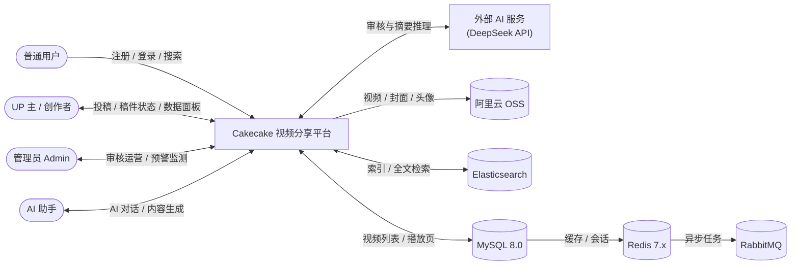
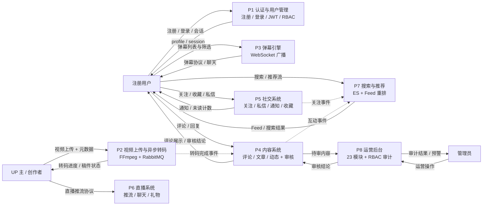
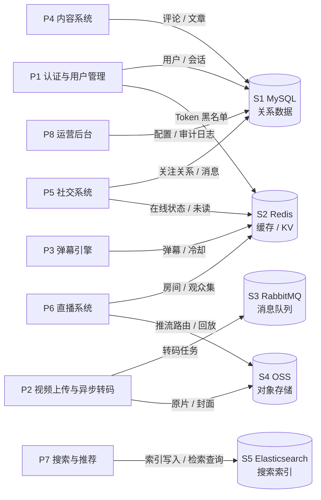
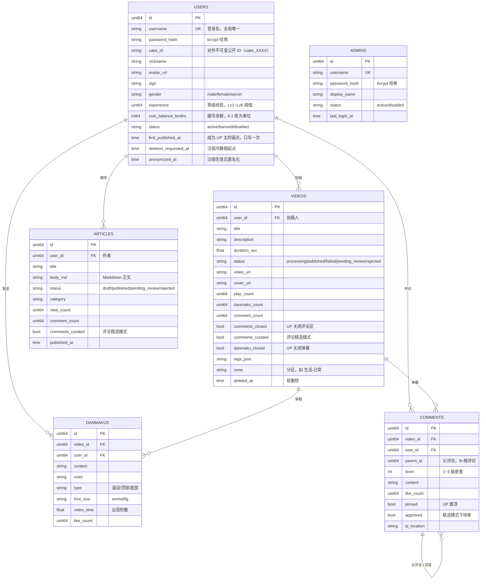
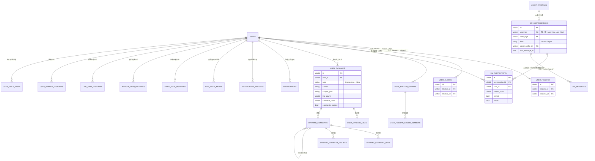

# 系统架构: Cakecake（Mini-Bili）全栈视频社交平台

**文档版本:** 3.0
**日期:** 2026-06-30
**作者:** 架构师 Winston（BMAD 框架）
**轨道:** BMad Method
**状态:** 已发布（v3.0，对标 SPEC v2.1 + 审计修正）
**来源 PRD:** `SPEC.md`（充当 PRD 角色）
**审计依据:** `docs/architecture-audit-2026-06-28.md`

> 这是横切技术决策的唯一真相源。所有后续开发任务继承此处记录的**锁定**决策。
> 在此层面捕获对齐的成本约为实现阶段的 1/10。

***

## 目录

1. [系统概述](#1-系统概述)
2. [架构模式](#2-架构模式)
3. [架构决策记录](#3-架构决策记录)
4. [组件设计](#4-组件设计)
5. [数据模型](#5-数据模型)
6. [API 规范](#6-api-规范)
7. [FR/NFR 覆盖矩阵](#7-frnfr-覆盖矩阵)
8. [技术栈](#8-技术栈)
9. [权衡分析](#9-权衡分析)
10. [部署架构](#10-部署架构)
11. [未来考虑](#11-未来考虑)

***

## 1. 系统概述

### 目的

Cakecake 是仿 B 站核心链路的全栈视频社交平台，后端 Go 模块名 `minibili`。系统涵盖用户认证、视频上传/转码、实时弹幕、多级评论、直播、社交体系（关注/私信/动态/收藏/投币）、ES 全文搜索、Feed 推荐、风控引擎，以及 **23 个运营后台模块**（全前后端对齐）。

### 范围

**在范围内:**

- **用户端:** 注册/登录（JWT 双 Token）、视频上传（≤500MB/≤30min→FFmpeg H.264 MP4→OSS）、弹幕 WebSocket（≤200ms, 5s 冷却+敏感词）、3 级评论（视频/文章/动态三套独立表）、点赞/投币/收藏（硬币经济）、关注/拉黑/私信（WebSocket 实时）、直播（nms 推流+HTTP-FLV/RTMP 播放 + WebSocket 聊天+礼物+弹幕飘屏）、Feed 推荐（MMR 多样性排序+协同过滤）、ES 全文搜索、历史追踪、每日任务
- **运营后台 23 模块:** 数据概览、首页轮播、热搜运营、用户管理、视频审核、专栏审核、直播管理、动态管理、评论管理、评论增强、系统设置、举报处理、AI 角色、工单管理、风控管理、版权管理、客服后台、运维监控 5 合 1、配置发布、权限审计、播放器高级、字幕管理、专题活动
- **社交体系:** 关注/取关、拉黑（双向互阻）、关注分组、多收藏夹、投币（coin\_ledgers）、图文动态发布、私信 WebSocket 实时推送
- **搜索与发现:** ES 全文搜索、热搜运营（Redis 热词+管理干预）、搜索历史、Feed 推荐（规则/热度+MMR 重排序）、排行榜
- **Service 层架构:** handler → service → DB 三层解耦，`internal/service/` 包（22 个文件，非测试 19）
- **基础设施:** MySQL 8.x + Redis 7.x + RabbitMQ 3.x + 阿里云 OSS + Elasticsearch 8.x（可选）+ Node-Media-Server

**不在范围内:**

- 支付/会员/充电等任何商业化功能（Non-Commercial License）
- CDN 实际分发（仅有管理 CRUD 接口）
- Whisper ASR（Worker 预留但未实现）

### 架构驱动因素

最制约设计的 NFR（从 SPEC.md 提取）：

1. **NFR-3（鉴权）:** 用户 JWT + Admin JWT 双体系隔离；RBAC resource:action 细粒度（23 种权限码）；全写操作审计
2. **NFR-1（并发）:** 弹幕 100 人在线 ≤200ms；运营后台 \~50 并发管理员
3. **NFR-2（存储）:** MySQL + Redis + RabbitMQ + OSS 四层存储
4. **NFR-4（API）:** RESTful，JSON 信封统一响应格式，统一错误码
5. **NFR-6（配置）:** .env 文件管理 + Feature Flag FNV-1a hash 灰度

### 代码规模（实测数据 2026-09-15）

| 指标                  | 数值                                 |
| ------------------- | ---------------------------------- |
| Go 源文件              | **193** 个（`internal/` 非测试；含测试 227）  |
| GORM AutoMigrate 模型 | **92** 个                           |
| RBAC 权限码            | **23** 种（`resource:action` 格式）     |
| Admin API 端点        | **210** 个（`/api/v1/admin/*`）       |
| 用户端 API 端点          | **164** 个（`/api/v1/*` 需登录）         |
| 公开只读端点              | **45** 个（`pub` 组）                  |
| WebSocket 通道        | **3** 套（弹幕/私信/直播聊天）                |
| 总路由注册               | **433** 条                          |
| Vue 3 前端页面          | **25** 个 admin 页面（+1 登录页）+ 用户端全栈    |
| 移动端 App 页面          | **20** 个（uni-app，4 tab + 16 二级，见 §12） |

### 利益相关者与约束

- **用户:** 普通用户、UP 主、运营管理员、内容审核员、客服、技术运维
- **团队:** 1 人全栈开发（PandaGuGu），Windows 环境，Go + Vue 3 技术栈
- **现有约束:** Go Gin 模块化单体、Vue 3 + Vite SPA、MySQL/Redis/RabbitMQ、阿里云 OSS
- **兼容性:** BC-2 要求支持未来平滑拆分为 Kratos 微服务

### 数据流图（DFD）

系统数据流从外部实体视角（上下文图）与主要处理过程视角（0 层图）两个层次描述。以下图均以 Mermaid 源码内嵌，可在 GitHub / VS Code / Typora 等支持 Mermaid 的渲染器中直接渲染，随文档版本化，无需维护图片文件。

**图 1. 上下文图（Context Diagram）** — 系统与外部实体（普通用户 / UP 主 / 管理员 / AI 助手 / 外部 AI 服务）之间的边界与数据交换，以及 MySQL → Redis → RabbitMQ 的存储链路。



**图 2. 一层数据流图（Level-0 DFD）— 过程与外部实体** — 8 个核心处理过程（认证、视频流水线、弹幕、内容、社交、直播、搜索推荐、运营后台）与 3 类外部实体之间的输入输出，以及过程间的审核与事件流转（虚线为内部信号）。



**图 3. 一层数据流图（Level-0 DFD）— 过程与数据存储** — 8 个处理过程对 5 个数据存储的读写关系，S 编号与图 1 一致。



**数据存储读写对照**

| 存储 | 写入方 | 读取方 |
| ---- | ---- | ---- |
| S1 MySQL | P1 用户/会话 · P4 评论/文章 · P5 关注/消息 · P8 配置/审计 | P1 · P4 · P5 · P7 · P8 |
| S2 Redis | P1 Token 黑名单 · P3 弹幕冷却 · P5 未读/在线 · P6 观众集 | P1 · P3 · P5 · P6 · P7 |
| S3 RabbitMQ | P2 转码任务入队 | P2 转码 Worker |
| S4 OSS | P2 原片/封面 · P6 推流路由/回放 | P2 · P6 · P7（播放页） |
| S5 Elasticsearch | P7 索引写入（视频/文章/用户） | P7 全文检索 |

***

## 2. 架构模式

**模式:** 模块化单体（Modular Monolith）

**论证:**

- 1 人团队维护微服务的运维负担远超当前规模收益
- 运营中心并发需求低（<50 管理员），用户端并发可控，单体足以支撑
- 文件级模块拆分（每个功能一个 handler 文件，共 86 个 handler 文件）已为未来微服务拆分预留边界
- BC-2 约束满足：handler 间不互相调用，通过共享 `API` 结构体的 `DB`/`Log`/`Svcs` 进行松耦合
- 三层架构（handler → service → DB）确保业务逻辑隔离

**考虑的替代方案:**

- **Kratos 微服务:** 1 人团队维护 10+ 独立服务的部署、配置、监控成本过高，当前并发无需独立扩缩容
- **纯单体无拆分规划:** 违反 BC-2 要求，未来重构成本指数级增长

**应用方式:**

```
minibili（单进程）
├── internal/handler/         ← 86 个 handler 文件，按模块拆分
│   ├── admin_*.go            ← 27 个运营后台 handler
│   ├── auth.go, video.go, …  ← 用户端 handler
│   ├── router.go             ← 路由注册（433 条）
│   └── deps.go               ← API 结构体（DI 依赖注入容器）
├── internal/service/         ← 业务逻辑层（22 个文件，非测试 19）
│   ├── services.go           ← Services 容器
│   ├── video_service.go      ← 视频 CRUD + 状态管理
│   ├── user_service.go       ← 用户管理 + 社交
│   ├── comment_service.go    ← 评论 + 通知
│   ├── feed_service.go       ← Feed 推荐 + MMR 重排序
│   └── ...
├── internal/middleware/      ← 横切关注点（认证/授权/追踪）
├── internal/model/           ← 92 个 GORM 模型
├── internal/data/            ← 数据层（DB + migrate + rbac_seed）
├── internal/worker/          ← RabbitMQ 消费者（转码 Worker）
├── internal/ws/              ← WebSocket Hub（弹幕/私信/直播）
└── internal/pkg/             ← 共享工具包（jwttoken/resp/errcode）
```

微服务拆分路径（未来）：handler 文件 → service 层提取 → 独立 Kratos 服务 → API 网关路由。

### Service 层架构（SPEC F15）

v2.0 引入三层解耦，所有业务逻辑从 handler 迁移到 service：

```
handler（HTTP 请求处理，参数验证/响应格式化）
  → service（业务逻辑，跨表事务/缓存协调/外部服务调用）
    → gorm.DB / redis.Client（数据访问）
```

**实现:**

```
internal/service/
├── services.go           ← Services 容器，聚合所有子 Service（DI 注入）
├── video_service.go      ← 视频上传/转码/状态管理/播放量
├── video_publish.go      ← 视频发布逻辑
├── user_service.go       ← 用户注册/登录/关注/投币
├── user_profile.go       ← 用户资料管理
├── comment_service.go    ← 评论CRUD/点赞/通知
├── feed_service.go       ← Feed 推荐（MMR/DPP）
├── rerank.go             ← 重排序算法（MMR）
├── playcount.go          ← Redis 播放计数 10s 落库
├── search_hot.go         ← 热搜聚合
├── search_suggest.go     ← 搜索建议
├── hot_search_admin.go   ← 热搜运营
├── hot_search_feed.go    ← 热搜 Feed
├── hot_search_layout.go  ← 热搜布局
├── agent.go              ← AI Agent 对话
├── article_publish.go    ← 文章发布
├── itemcf.go             ← ItemCF 离线相似度计算（商品/视频协同过滤）
├── state_transition.go   ← 状态机守卫（TransitionGuard，包装 statemachine）
└── danmaku_relay.go      ← 弹幕中继
```

**锁定规则:** 新增业务逻辑优先写入 service；handler 仅保留 HTTP 层职责；service 不直接引用 `gin.Context`。

### WebSocket 架构

平台有三套独立的 WebSocket 通信通道：

| 通道   | 端点                                        | 用途            | 技术                                                     | 并发目标          |
| ---- | ----------------------------------------- | ------------- | ------------------------------------------------------ | ------------- |
| 弹幕   | `ws://host/ws/danmaku?video_id=X&token=X` | 实时弹幕推送        | gorilla/websocket，5s 冷却，敏感词过滤，Canvas 多轨道               | 100 在线 ≤200ms |
| 私信   | `ws://host/ws/chat?token=X`               | 实时私信推送        | JWT 鉴权，双向通信，conversation\_id 路由                        | 按需            |
| 直播聊天 | `ws://host/ws/live?room_id=X&token=X`     | 直播间聊天+礼物+弹幕飘屏 | 同一 WebSocket 库，消息类型(chat/gift/system/admin\_warning)区分 | 单房间多观众        |

**锁定规则:** 三套 WS 复用心跳机制（30s ping/pong）；消息体统一 JSON 信封 `{type, data, timestamp}`；断线自动重连（指数退避，最大 30s）；鉴权失败立即发送 `auth_failed` → 关闭连接。

### Feed 推荐架构（当前已实施）

> 当前状态：**ItemCF 协同过滤已全链路上线** —— 离线计算 `service/itemcf.go`（`ComputeItemCF`，6 张行为表加权）+ 每日调度 `worker/scheduler.go`（`scheduleItemCF`，每 24h，写入 `video_similarities`）+ 在线召回 `feed_service.itemCFRecall`（读取相似度表并入候选集）三者齐备；在线重排序为 MMR 多样性。剩余待补：冷启动提权。

#### 召回层

```
四路并发召回:
  1. 热门召回: Redis Sorted Set（时间衰减播放量）→ 冷启动兜底
  2. 内容召回: 同分区 + 同标签匹配
  3. 社交召回: 关注 UP 主的新发布
  4. ItemCF 召回: 用户交互过的视频 → video_similarities 表（离线预计算）→ 规划中
```

#### 重排序（MMR + DPP）

```
候选集 → MMR 重排序:
  Score = Relevance(video, user) - λ × max(Sim(video, already_selected))
  λ = 0.7（多样性强度）
  → 类目打散 + 频控（Redis 曝光计数器）
  → 游标分页（limit ≤ 50, next_cursor）
```

**匿名用户策略:** Redis 缓存热门推荐（TTL 5min），减少重复计算。

### ES 搜索架构

```
用户搜索请求
  ↓
GET /api/v1/search?q=X&type=video|article|user
  ↓
ES 全文检索（ik 中文分词）
  ↓
返回 ID 列表 → MySQL 补全详情 → JSON 响应
```

**索引策略:**

- `videos` 索引: title, description, tags (ik\_smart 分词)
- `articles` 索引: title, content (ik\_max\_word 分词)
- `users` 索引: username, nickname (keyword + ik\_smart)
- 热搜运营: Redis Sorted Set 热词 + `hot_search_ops` 表人工干预
- 搜索历史: Redis List per user，最大 50 条

### 风控引擎

```
用户发表内容 → resolveContentOwner(定位作者)
  → isWhitelisted? → 是 → 放行 ✅
  → isBlacklisted? → 是 → reject + 通知 ❌
  → 加载 enabled 规则(按 priority DESC)
  → 逐条匹配: keyword | regex | rate_limit
  → 命中 → 写 RiskHitLog → 按 Action 分流:
      reject       → 返回 blocked=true
      quarantine   → 评论设 approved=false
      notify_admin → WebSocket 实时推送
      auto_ban     → User.Status="banned" + BanExpiresAt → 自动解封
```

**关键设计:** 白名单优先；正则缓存 per rule；频率窗口 `risk_rate_counters` 表；后台 goroutine 每 60s 清理过期黑名单+自动解封。

### 状态管理策略

**业务状态（后端）:** 2026-08-20 起由 `internal/pkg/statemachine` 统一治理（ADR-018）——8 个业务域的合法转移集中定义，散落的裸状态写入逐步收拢为 `machine.Can(from,to)` 校验 + 时间驱动执行器。

**前端状态:** Vuex 4.x 集中式状态管理。

- **服务端状态:** 管理后台数据通过 API 响应直接消费，不做客户端缓存。
- **认证状态:** JWT Token 存储在 `localStorage`，通过 Axios 拦截器自动注入 `Authorization` header。
- **路由状态:** `vue-router` 管理路由，路由守卫检查认证+权限（通过 `GET /admin/rbac/me/permissions` 获取）。
- **UI 状态:** Vuex store 管理侧边栏折叠/展开、管理员信息、权限列表。

**锁定规则:** 所有管理页面通过 `AdminLayout.vue` 统一布局；跨页面共享状态存储在 Vuex store。

***

## 3. 架构决策记录（ADR）

> 核心产出物。每个横切选择是一个 ADR。

### ADR 索引

| ADR     | 标题                                               | 状态                     | 驱动           | 日期                         |
| ------- | ------------------------------------------------ | ---------------------- | ------------ | -------------------------- |
| ADR-001 | REST + JSON 信封响应格式                               | 已接受                    | NFR-4        | 2026-06-25                 |
| ADR-002 | MySQL 8.x + GORM AutoMigrate + Redis + RMQ + OSS | 已接受                    | NFR-2, NFR-1 | 2026-06-25                 |
| ADR-003 | 独立管理员 JWT 双 Token 认证                             | 已接受                    | NFR-3        | 2026-06-25                 |
| ADR-004 | RBAC resource:action 细粒度授权（23 种权限码）              | 已接受                    | NFR-3        | 2026-06-25                 |
| ADR-005 | 模块化单体架构 (Gin)                                    | 已接受                    | NFR-1, BC-2  | 2026-06-25                 |
| ADR-006 | 全写操作自动审计日志                                       | 已接受                    | NFR-3        | 2026-06-25                 |
| ADR-007 | 统一错误码体系（errcode 包，38 个错误码）                       | 已接受                    | NFR-4        | 2026-06-25                 |
| ADR-008 | Feature Flag FNV-1a 灰度策略                         | 已接受                    | NFR-6        | 2026-06-25                 |
| ADR-009 | 审批流多级串行审核                                        | 已接受                    | NFR-3        | 2026-06-25                 |
| ADR-015 | 流媒体选型：nms（本地默认）/ SRS（生产正轨）                       | **已实施**                | FR-050       | 2026-06-28（2026-08-22 补权衡） |
| ADR-016 | ItemCF 协同过滤推荐引擎                                  | 部分实施（离线+在线召回已上线，冷启动待补） | NFR-REC-1/2  | 2026-06-28                 |
| ADR-017 | GORM 软删除（Video/Article 等核心实体）                    | 已接受                    | 数据完整性        | 2026-06-28                 |
| ADR-018 | 轻量状态机治理（internal/pkg/statemachine）               | 已实施                    | 状态一致性/审计     | 2026-08-20                 |

### ADR-001: REST + JSON 信封响应格式

**状态:** 已接受   **驱动:** NFR-4

**Context（背景）:** SPEC NF-4 要求所有 API 使用 RESTful 风格 + 统一 JSON 响应格式。Rule R-API-1 严格定义了 `{code, msg, data}` 格式。

**Decision（决策）:**

- 所有 HTTP API 使用 RESTful 风格（GET 查询/POST 创建/PUT+PATCH 更新/DELETE 删除）
- URL 使用复数名词（`/videos`，非 `/video`），不走动词路径
- 统一 JSON 响应：`{ "code": number, "msg": string, "data": object | null }`
- code 0 = 成功，40001-50099 = 业务/认证/权限/服务器错误
- 实现：`internal/pkg/resp/resp.go` 提供 `OK(c, data)` 和 `Err(c, code)` 工厂函数

**Consequences（后果） — 对所有开发锁定:**

- 所有 handler 必须使用 `resp.OK` / `resp.Err`，严禁裸 `c.JSON`
- 新增错误码必须在 `internal/errcode/errcode.go` 注册
- 无数据时 `data` 字段返回 `null`，非空
- 变得容易: 前端统一拦截器处理错误；API 文档自动生成
- 接受的代价: 简单 GET 请求也需要嵌套结构

**替代方案:**

- **GraphQL:** 学习成本/性能难以控制，团队不熟悉，前端不需要灵活查询
- **gRPC:** 不适合浏览器直调，多一层网关复杂度

**重新审视条件:** 流量 > 5 万并发用户时评估是否需要 GraphQL 聚合查询

***

### ADR-002: MySQL 8.x + GORM AutoMigrate + Redis + RabbitMQ + OSS

**状态:** 已接受   **驱动:** NFR-2

**Context（背景）:** SPEC NF-2 要求 MySQL 主库 + Redis 热数据 + RabbitMQ 异步任务 + OSS 文件存储。Rule R-DB-1/2/3/4 严格定义了数据库安全规范。

**Decision（决策）:**

- **主存储:** MySQL 8.x + GORM v2 AutoMigrate，92 个模型自动建表
- **缓存:** Redis 7.x — 播放量 INCR（10s 落库）、弹幕冷却 SET NX EX（5s）、Token 黑名单、热搜 ZINCRBY、直播观众 SET
- **消息队列:** RabbitMQ 3.x — 视频转码任务（`task_type=transcode`），预留 `subtitle_asr`
- **文件存储:** 阿里云 OSS（`mini-bili` Bucket），目录前缀分区；本地文件系统兜底（Docker 卷 `uploads_data`）
- **ID 策略:** 自增 uint64 主键
- **索引策略:** GORM tag `index` + `uniqueIndex`，核心查询字段（play\_count, created\_at, user\_id, video\_id）必须建索引
- **事务:** 多表写操作使用 GORM 事务（如投币：INSERT coin → UPDATE balance → INSERT ledger）

**Consequences（后果） — 对所有开发锁定:**

- 严禁硬编码连接字符串（必须从环境变量读取）
- 严禁拼接 SQL（必须使用 GORM 参数化查询）
- 数据库变更必须通过 AutoMigrate（在 `internal/data/migrate.go` 注册模型）
- 严禁生产环境 `DROP TABLE` 或 `ALTER TABLE` 收缩字段
- 变得容易: 零迁移脚本维护，模型定义即数据库
- 接受的代价: 不支持复杂迁移（如列重命名）；生产缺乏版本控制

**替代方案:**

- **PostgreSQL:** 团队不熟悉，阿里云 MySQL 成本更低
- **MongoDB:** 关系型数据不适用（用户/视频/评论多表关联）
- **golang-migrate:** 1 人团队增加维护负担

**重新审视条件:** 生产部署或多人协作时切换 golang-migrate

***

### ADR-003: 独立管理员 JWT 双 Token 认证

**状态:** 已接受   **驱动:** NFR-3

**Context（背景）:** 用户端和管理端需要完全独立的认证体系。SPEC NF-3 要求双 JWT 体系隔离。

**Decision（决策）:**

- **用户 JWT:** Access Token 2h + Refresh Token **30d**（实际代码，非文档声称的 7d）
- **管理员 JWT:** Access Token 2h + Refresh Token **3d**
- 密码存储: `golang.org/x/crypto/bcrypt`（cost=12）
- 实现: `internal/pkg/jwttoken/` 包，双 Manager 实例
- Refresh Token 刷新时旧 Token 立即加入 Redis 黑名单（TTL 与 Token 有效期间）
- 管理员和用户使用独立的中间件（`AdminJWTAuth` / `JWTAuth`），路由分组隔离

**Consequences（后果） — 对所有开发锁定:**

- 用户端和管理端 API 路由必须分离（`/api/v1/admin/*` vs `/api/v1/*`）
- 严禁 Refresh Token 用于业务 API 访问
- 刷新后必须标记旧 Refresh Token 失效
- 严禁在 Access Token 中存储密码等敏感信息
- 变得容易: 无状态认证，无需 session 存储

**替代方案:**

- **统一 JWT + Role 字段:** 权限边界模糊，攻击面增大
- **Session:** 需要额外存储，不支持水平扩展

**重新审视条件:** OAuth2/OIDC 集成需求出现时重新评估

***

### ADR-004: RBAC resource:action 细粒度授权（23 种权限码）

**状态:** 已接受   **驱动:** NFR-3

**Context（背景）:** 23 个运营模块需要差异化访问控制。SPEC 定义的 23 种权限码（`resource:action` 格式）覆盖所有管理操作。

**Decision（决策）:**

- **模型:** `admin_roles` + `admin_permissions` + `role_permissions`(关联) + `admin_role_assignments` 四表
- **权限格式:** `resource:action`（如 `video:approve`, `user:ban`, `risk:manage`）
- **中间件:** `RequirePermission(db, resource, action) gin.HandlerFunc`
- **23 种权限码（`rbac_seed.go` 实测清单）:**
  - 📊 数据: `dashboard:view`, `dashboard:export`
  - 📢 运营: `banner:manage`, `hotsearch:manage`, `special:manage`, `dynamic:manage`, `subtitle:manage`
  - 🛡️ 审核: `video:approve`, `article:approve`, `comment:delete`, `ticket:handle`, `report:handle`, `copyright:handle`, `risk:manage`
  - 👤 用户: `user:ban`, `cs:manage`
  - 🤖 AI: `agent:manage`, `llm:manage`
  - ⚙️ 系统: `setting:manage`, `config:manage`, `ops:manage`, `rbac:manage`, `live:manage`
  - 注：`dashboard:view`、`llm:manage`、`report:handle` 已注册但当前无路由中间件直接引用（`report:handle` 的 Resource 字段实际写为 `ticket`，中间件按 `ticket:handle` 校验，见 `rbac_seed.go` 注释）
- **角色:** `super_admin`（全部权限）, `content_review`（审核组+封禁+只读）, `cs_admin`（客服组+只读）
- 前端侧边栏按 `GET /admin/rbac/me/permissions` 返回权限列表动态过滤

**Consequences（后果） — 对所有开发锁定:**

- 新增管理操作必须在 `rbac_seed.go` 注册权限码
- 路由注册时通过 `admin.Group("", RequirePermission(...))` 分组保护
- 所有写操作自动记录 `audit_logs`（ADR-006）
- 变得容易: 自建 4 表模型 + 3 表 JOIN 即可满足，无额外依赖

**替代方案:**

- **Casbin:** DSL 学习成本高，23 种简单权限无需引入额外复杂度

**重新审视条件:** 需要 ABAC（基于属性）如"仅工作日可操作"时

***

### ADR-005: 模块化单体架构 (Gin)

**状态:** 已接受   **驱动:** NFR-1, BC-2

**决策:** 单进程 Gin 应用，193 个 Go 源文件按功能拆分目录。handler → service → DB 三层。

**权衡:** 见第 9 节。

***

### ADR-006: 全写操作自动审计日志

**状态:** 已接受   **驱动:** NFR-3

**Decision（决策）:**

- 所有 admin 写操作 handler 调用 `a.recordAudit(c, adminID, action, resource, targetID, detail)`（定义在 `handler/admin_ops.go`，`*API` 的方法）
- `audit_logs` 表: `id, admin_id, action, resource, target_id, detail(JSON text), ip_address, created_at`
- 索引: 单列索引 `admin_id`、`created_at`、`resource`、`target_id`、`action`（非复合索引）

**锁定规则:** 新增 admin 写操作必须调用 `recordAudit`；审计日志 append-only，不可删除。

***

### ADR-007: 统一错误码体系

**状态:** 已接受   **驱动:** NFR-4

**Decision（决策）:**

- 38 个错误码映射表（`internal/errcode/errcode.go`）
- 分类: 0=成功, 40001-40099 参数校验, 40100-40199 认证, 40300-40399 权限, 40400-40499 资源, 50000-50099 服务器
- `errmsg.GetMsg(code)` 获取国际化消息

***

### ADR-008: Feature Flag FNV-1a 灰度策略

**状态:** 已接受   **驱动:** NFR-6

**Decision（决策）:**

- `feature_flags` 表: `flag_key, enabled, rollout_pct, whitelist JSON`
- FNV-1a hash 分桶: `hash(user_id) % 100 < rollout_pct` → 灰度命中
- 白名单优先级高于灰度
- 配置发布流程: 模块注册 → Flag 管理 → 版本发布（快照→部署→回滚，draft→deployed→rolled\_back）

***

### ADR-015: 直播流媒体技术选型 — Node-Media-Server（当前本地默认）/ SRS（生产正轨，可切换）

**状态:** 已实施   **驱动:** FR-050, NFR-LIVE-1/2, NFR-COST-1

**Context（背景）:** 直播需要 RTMP 推流接入 + 分发播放 + `publish/done` 回调通知后端。项目存在**两套并存的启动路径**：`docker-compose.yml` 部署 SRS 5.x（`deploy/srs-docker.conf`），本地单点脚本 `scripts/start.ps1` 运行 Node-Media-Server（`scripts/rtmp-server.js`）。2026-08-17 公网通道停用、回退本地单点后，实际在用的是 **nms**。仓库无正式"从 SRS 迁至 nms"的决策记录——准确表述是"当前本地部署默认 nms，SRS 作为可切换的生产正轨保留"。

**Decision（决策）:**

- **两套流服务器并存**，通过启动环境选择，代码零改动切换（FLV URL 格式两者一致：`http://<host>:8000/live/{key}.flv`）。
  - **本地单点（当前现实）:** nms — `scripts/rtmp-server.js`，`node` 运行，RTMP :1935 + HTTP-FLV :8000 + `/api/streams` 供 App 真在播判定。纯 npm 即用，复用已装的 Node，零新增运行时。
  - **容器化/生产正轨:** SRS 5.x — `docker-compose.yml` 的 `srs` 服务 + `deploy/srs-docker.conf`，`ossrs/srs:5`。
- **播放链路:** PC 端 flv.js 走 HTTP-FLV；App 端 nvue `<live-player>` 直连原生 RTMP（`rtmp://host:1935/live/{key}`）。
- **真在播判定:** 查 nms `:8000/api/streams` 的 `publisher` 字段，App 首页直播 tab 仅显示有 active publisher 的房间。

**Consequences（后果） — 对所有开发锁定:**

- 新增直播流场景使用同一 URL 规范，不得硬编码 `localhost`；沿用 `VITE_API_BASE_URL_APP` / nms host 提取。
- 回调对接后端 `handler/router.go` 的 `SRSOnPublish` / `SRSOnDone`，函数名沿用历史命名，不因 nms 改函数名。
- 未来恢复公网 / 观众规模上升时，切到 SRS 正轨；nms 用于本地低成本联调。

**技术权衡（权衡核心）:**

| 维度           | SRS                                                  | nms（当前本地默认）                                           |
| ------------ | ---------------------------------------------------- | ----------------------------------------------------- |
| 语言/形态        | C++ 二进制，docker/编译                                    | Node.js npm 包                                         |
| Windows 本地部署 | 需 Docker 或手动编二进制                                     | `cd scripts && npm install && node rtmp-server.js` 即用 |
| 依赖新增         | 引入 Docker 运行时                                        | 零新增（Node 前端本就需装）                                      |
| 并发能力         | 数千级连接、多码率、WebRTC、集群                                  | 数十\~百级；Node 单线程，旁路转码/高并播放会卡                           |
| 延迟           | 更低（原生 HTTP-FLV/WebRTC）                               | 够用（单房间小延时）                                            |
| 内置 HLS       | 成熟                                                   | 功能不可靠（曾需手动 ffmpeg，见 Lessons Learned）                  |
| FLV URL 格式   | `http://host:8000/live/{key}.flv`（host 8000→容器 8080） | 同格式，天然兼容                                              |

**为何当前选 nms（trade-off，非性能定论）:**

- SRS 性能的确更好，但当前瓶颈不在流服务器——单直播间、个位数\~几十观众、`NFR-COST-1`（月 ≤500 元）。SRS 的高并发/多码率/WebRTC 在该规模下是零收益。
- nms 的短板（Node 单线程、内置 HLS 不可靠）在规模未上去前不构成实际损失，且本地零成本启动。
- SRS 已就绪、URL 兼容，切回无代码代价，故不删除、保留为生产正轨。

**替代方案:**

- **ZLMediaKit:** 功能更强（多协议/WebRTC），但 C++ 部署重，不匹配 1 人团队 + 低成本约束。
- **agora/腾讯云直播（B 站用自研/商业 CDN）:** 商业化依赖，违反 Non-Commercial License 与 ≤500 元约束，不作考虑。

**重新审视条件:** 恢复公网部署 或 观众规模显著上升（需多码率/更低延迟/录制回放）时，切换/统一到 SRS 生产正轨。

***

### ADR-016: ItemCF 协同过滤推荐引擎

**状态:** 部分实施（MMR/DPP 重排序 + ItemCF 离线计算 + 在线召回已落地，冷启动提权待补）

**Context（背景）:** SPEC F17 定义。当前在线服务已有 MMR 多样性重排序和四路召回。

**已实施:**

- 在线服务: `GET /api/v1/feed/recommendation` + 分区推荐 + 订阅源 + 排行榜
- 重排序: MMR 算法（λ=0.7） + 类目打散 + 频控
- 四路召回: 热门 + 内容 + 社交 + **ItemCF**（2026-08-20 落地）
- 离线计算: `internal/service/itemcf.go` — 7 行为加权（赞1.0/币3.0/藏2.0/看0.5/评1.5/弹1.0）→ Cosine 相似度 → 阈值 0.15 → `video_similarities` 表（清表重建，chunk 2000 批量插入）
- 调度: `worker/scheduler.go` `scheduleItemCF` — 启动即跑 + 每 24h 重算，`task_logs` 记录
- 在线召回: `FeedService.itemCFRecall` — 登录用户按最近交互（like/coin/fav）查相似视频，与热池合并后进 MMR

**待实施:**

- 冷启动策略: 新用户热门兜底（已有），新视频内容相似度提权×2.0 未实现
- 相似度阈值与矩阵规模的自动裁剪（视频量 > 10 万时评估 Embedding 召回，见 §11）

***

### ADR-018: 轻量状态机治理（internal/pkg/statemachine）

**状态:** 已实施（2026-08-20）   **驱动:** 状态一致性 / ADR-006 审计 / 时间驱动变迁

**Context（背景）:** 全平台 10+ 业务域（视频/文章/工单/举报/版权/审批/用户等）的状态流转此前是"隐式状态机"——状态字符串散落 30+ 处、部分写入点无前置校验（如 `failed` 视频可被直接置 `published`）、时间驱动变迁（SLA/定时发布/自动解封）存在"无消费者"缺口（`scheduled_publishes` 有表无执行器、SLA worker 用 `updated_at` 而非 `sla_deadline`）。

**Decision（决策）:**

- 自研轻量状态机包 `internal/pkg/statemachine`（`domains.go` 85 行 + `statemachine.go` 106 行，零第三方依赖）：`Machine{Name, Transitions}` + `Can(from,to)` + `Transition(from,to,actor)`（校验 + 可选 `OnChange` 审计钩子）+ `IllegalTransitionError`
- 9 个域集中定义：Video / Article / Ticket / Report / Copyright / ApprovalFlow / ApprovalStep / User / Appeal（见 `domains.go` 的 `All()`）
- 接入范围（7 个域已接线，共 8 个调用文件）：
  - `service/video_publish.go` `PublishVideo`：仅 processing/pending\_review → published
  - `service/video_service.go` `Publish/Reject`（原孤儿方法，补前置状态校验）
  - `worker/scheduler.go` `scheduleScheduledPublishes`：draft → processing 前置校验
  - `worker/transcode.go`：转码成功/失败**内联** `cur.Status != "processing"` 守卫（未引入 statemachine 包，行为等价 processing → pending\_review / failed）
  - `handler/admin_ticket.go` `AdminUpdateTicketStatus`：以转移表替代白名单（收紧 open 不得直跳 resolved/closed）
  - `handler/admin_copyright.go` `AdminTakedownContent`/`AdminRestoreContent`：takedown/restore 前置校验
  - `handler/admin_article.go` 审核、`handler/admin_rbac.go` 审批流：以状态机检查替代散落 if
  - `handler/appeal.go`：申诉裁决（Appeal 域，`Transition`）+ 到期解封（User 域，`Can("banned","active")`）
- 已定义未接线域：`Report`、`ApprovalStep`（`All()` 已注册，仓库内暂无 `statemachine.Report` / `statemachine.ApprovalStep` 调用点）
- 时间驱动执行器（`worker/scheduler.go`，每 1min）：
  - `scheduleScheduledPublishes`：**补齐定时发布消费者**（PublishAt 到期 → draft → processing，原无消费者）
  - `scheduleSLAEscalation`：按 `sla_deadline` 驱动升级 urgent（替代 main.go 按 updated\_at 的旧逻辑；不再自动关单，人工审核优先）
  - `scheduleAutoUnban`：到期解封走用户状态机（banned → active）

**Consequences（后果）:**

- 非法转移统一返回 `IllegalTransitionError`，调用方在写库前拦截
- 状态定义集中一处，新增状态先改 `domains.go`
- 审计钩子与 ADR-006 对接（OnChange 可写 audit\_logs）
- 未来转移图复杂化时，转移表可 1:1 映射到事件驱动 FSM（looplab/fsm），无需重构业务代码

**替代方案:**

- **looplab/fsm 等框架:** 事件驱动模型（State+Event+Callback），本项目转移以"操作→状态"线性流为主，框架能力用不上；引入需重写全部写状态点 + 学习成本
- **维持现状（裸 if）:** 状态散落、非法转移无防护、时间驱动缺失——本次评审判定已失守

**重新审视条件:** 某域出现复杂嵌套流转（如工单 SLA 多级升级 + 审批流嵌套）时，将对应域迁移到事件驱动 FSM。

***

## 4. 组件设计

### 组件总览

```
                     ┌──────────────────────────────────┐
                     │   Vue 3 SPA (cakecake-vue)        │
                     │   ┌────────────┐ ┌─────────────┐ │
                     │   │ AdminLayout│ │ App.vue     │ │
                     │   │ /admin/*   │ │ +app-header │ │
                     │   │            │ │ /* (用户端)  │ │
                     │   └─────┬──────┘ └──────┬──────┘ │
                     └─────────┼───────────────┼────────┘
                               │ HTTP REST + JWT│
                               ▼                ▼
              ┌─────────────────────────────────────────┐
              │         Gin Router (router.go)           │
              │    /api/v1/admin/*  │  /api/v1/*         │
              │    ┌───── Middleware Chain ───────────┐  │
              │    │ 1. CORS                           │  │
              │    │ 2. Gin Logger (Zap)               │  │
              │    │ 3. Trace (middleware/trace.go)    │  │
              │    │ 4. JWT Auth (Admin / User 双体系) │  │
              │    │ 5. RequirePermission (admin 路由) │  │
              │    │ 6. recordAudit (写操作 handler)   │  │
              │    └───────────────────────────────────┘  │
              └───────┬──────────────┬───────────────────┘
                      │              │
         ┌────────────▼──┐  ┌───────▼──────────┐
         │ Admin Handlers│  │  User Handlers   │
         │ (27 files)    │  │  (59 files)      │
         │  ┌──────────┐ │  │  auth/video/      │
         │  │Service   │ │  │  comment/social/  │
         │  │ Layer DI │ │  │  live/search/dm   │
         │  └──────────┘ │  └───┬──────────────┘
         └───┬───────────┘      │
             │  ┌───────────────▼──────────────┐
             │  │   Service Layer              │
             │  │   internal/service/ (19 files)│
             │  │   Services{Video,User,...}    │
             │  └───────────────┬──────────────┘
             │                  │
     ┌───────▼──────┬───────────▼───────┬──────────┐
     │    MySQL 8.x │     Redis 7.x     │ RabbitMQ │
     │ (92 模型,GORM)│   (Cache/冷却/    │ (转码)   │
     │              │    Token黑名单)   │          │
     └───────┬──────┴───────────────────┴──────────┘
             │
     ┌───────▼───────┐     ┌────────────────┐
     │  Aliyun OSS   │     │ Elasticsearch  │
     │  或本地存储    │     │ (全文搜索,可选)│
     └───────────────┘     └────────────────┘
             │
     ┌───────▼───────┐
     │  Node-Media-  │
     │  Server (nms) │
     │  (直播推流)   │
     └───────────────┘
```

### 核心组件详述

#### 组件: Authentication

**职责:** 用户/管理员身份验证和 JWT Token 管理
**实现:** `handler/auth.go`, `handler/admin_auth.go`, `internal/pkg/jwttoken/`
**提供的接口:** `POST /auth/login`, `POST /admin/auth/login`, `POST /auth/refresh`, `POST /admin/auth/refresh`
**需要的接口:** `gorm.DB`（User/Admin 表）, `bcrypt`, Redis（黑名单）
**拥有的数据:** `User`, `Admin`
**约束它的 ADR:** ADR-003, ADR-002
**处理的 NFR:** NFR-3（鉴权）

#### 组件: RBAC Authorization

**职责:** 基于 resource:action 的权限拦截 + 角色/权限/管理员管理
**实现:** `middleware/rbac_permission.go`, `handler/admin_rbac.go`, `data/rbac_seed.go`
**提供的接口:** `RequirePermission(db, resource, action) gin.HandlerFunc`, `/admin/rbac/*`（20 个端点，含 `/admin/rbac/me/permissions`）
**需要的接口:** `gorm.DB`, JWT 中间件
**拥有的数据:** `AdminRole`, `AdminPermission`, `RolePermission`, `AdminRoleAssignment`, `AdminLoginLog`
**约束它的 ADR:** ADR-004, ADR-006, ADR-009
**处理的 NFR:** NFR-3（鉴权 + 审计）

#### 组件: Video Pipeline

**职责:** 视频上传 → 转码 → 发布全链路
**实现:** `handler/video.go`, `handler/video_oss.go`, `worker/transcode.go`, `service/video_service.go`
**提供的接口:** `POST /videos`（上传）, `POST /videos/:id/publish`（发布）, `PUT /videos/:id`（更新）
**需要的接口:** RabbitMQ, FFmpeg, OSS/本地文件存储, Redis（播放计数）
**拥有的数据:** `Video`, `VideoChapter`, `VideoBitrate`
**约束它的 ADR:** ADR-001, ADR-002
**处理的 NFR:** NFR-1（异步转码解耦）

#### 组件: Danmaku Engine

**职责:** 实时弹幕发送 + WebSocket 广播 + Canvas 渲染
**实现:** `handler/danmaku.go`, `handler/ws.go`, `internal/ws/`
**提供的接口:** `POST /videos/:id/danmaku`（发送）, `GET /ws/danmaku`（WebSocket）
**需要的接口:** Redis（5s 冷却 SET NX EX + 200 条历史）, 敏感词过滤器, gorilla/websocket
**拥有的数据:** `Danmaku`, `DanmakuLike`
**约束它的 ADR:** ADR-001
**处理的 NFR:** NFR-1（100 在线 ≤200ms）

#### 组件: Comment System

**职责:** 视频/文章/动态三套独立评论表 + 3 级嵌套 + UP 主管理
**实现:** `handler/comment.go`, `handler/article_comment.go`, `handler/dynamic_comment.go`, `service/comment_service.go`
**提供的接口:** `GET /videos/:id/comments`, `POST /videos/:id/comments`, `DELETE /comments/:id`
**需要的接口:** `gorm.DB`, WebSocket Hub（评论删除广播）, 风控引擎（敏感词/隔离）
**拥有的数据:** `Comment`, `ArticleComment`, `DynamicComment`, `CommentLike`, `CommentDislike`, `CommentImage`
**约束它的 ADR:** ADR-002, ADR-004
**处理的 NFR:** NFR-3（权限校验：UP 主/本人/管理员）

#### 组件: Social System

**职责:** 关注/拉黑/私信/动态/收藏/投币
**实现:** `handler/user_follow.go`, `handler/follow_group.go`, `handler/user_block.go`, `handler/dm.go`, `handler/dm_ws.go`, `handler/user_me.go`（通知/资料）, `handler/user_dynamic.go`, `handler/follow_feed.go`, `handler/favorite_folder.go`, `handler/coin_ledger.go`, `handler/video_engagement.go`, `handler/article_engagement.go`
**提供的接口:** 100+ 端点覆盖全部社交操作
**拥有的数据:** `UserFollow`, `UserBlock`, `FavoriteFolder`, `VideoFavorite`, `VideoCoin`, `CoinLedger`, `UserDynamic`, `DmConversation`, `DmMessage`
**约束它的 ADR:** ADR-002, ADR-003

#### 组件: Live Streaming

**职责:** 直播间创建/管理 + Node-Media-Server 推流 + HTTP-FLV/RTMP 播放 + WebSocket 聊天+礼物
**实现:** `handler/live.go`, `handler/admin_live.go`, `handler/ws.go`（直播 WS 通道）, `scripts/rtmp-server.js`（nms 实例）
**提供的接口:** `/live/rooms/*`, `/live/callback/*`, `/admin/live/*`
**需要的接口:** Node-Media-Server RTMP 服务器（`:8000/api/streams` 供真在播判定）, flv.js / nvue `<live-player>`
**拥有的数据:** `LiveRoom`, `LiveWarnTemplate`
**约束它的 ADR:** ADR-015
**处理的 NFR:** NFR-LIVE-1/2（已达标）

#### 组件: Risk Engine

**职责:** 多层级风控规则匹配（关键词/正则/频率限制）+ 黑白名单
**实现:** `handler/admin_risk.go`, `handler/sensitive_ugc.go`
**提供的接口:** `/admin/risk/*`（11 个端点）+ `/admin/appeals*`、`/admin/users/:id/capabilities`、`/admin/usercap/templates*`（同属 risk:manage 权限组，共 20 个端点）
**拥有的数据:** `RiskRule`, `BlackWhiteList`, `RiskHitLog`, `RiskRateCounter`
**约束它的 ADR:** ADR-004, ADR-006

#### 组件: BI Reports

**职责:** 数据仪表盘 + 多维度统计 + CSV 导出
**实现:** `handler/admin_bi.go`, `handler/admin_dashboard.go`
**提供的接口:** `/admin/bi/*`（11 个端点）, `/admin/dashboard`
**拥有的数据:** `SavedReport`, `VideoDailyStat`
**约束它的 ADR:** ADR-004

#### 组件: Ops Monitoring（5合1）

**职责:** 任务队列/告警/链路追踪/健康检查/CDN 刷新/OSS 生命周期
**实现:** `handler/admin_ops.go`, `middleware/trace.go`
**提供的接口:** `/admin/ops/*`（21 个端点）
**拥有的数据:** `TaskLog`, `AlertRule`, `AlertRecord`, `TraceRecord`, `CDNRefreshTask`, `OSSLifecycleRule`
**约束它的 ADR:** ADR-004

#### 组件: Config Management

**职责:** Feature Flag 灰度发布 + 模块注册 + 版本发布/快照/回滚
**实现:** `handler/admin_config.go`
**提供的接口:** `/admin/config/*`（12 个端点）
**拥有的数据:** `FeatureFlag`, `ReleaseRecord`
**约束它的 ADR:** ADR-008

### 前端共享组件体系（SPEC F16）

```
src/
├── components/admin/
│   ├── AdminDataTable.vue    ← 统一搜索+表格+分页（已接入 8 个 admin 页面）
│   ├── AdminFormDialog.vue   ← 统一新增/编辑弹窗
│   └── BiCard.vue / BiChart.vue ← BI 卡片与图表
├── utils/
│   ├── admin-helpers.js      ← 共享 formatTime() 等工具函数
│   └── adminAuth.js / adminHttp.js ← admin 登录态与请求封装
└── api/admin/                ← 18 模块模块化 API
    ├── agent.js, appeal.js, article.js, auth.js, banner.js,
    ├── comment.js, copyright.js, cs.js, dashboard.js, dynamic.js,
    ├── hot-search.js, rbac.js, report.js, settings.js,
    ├── special.js, ticket.js, user.js, video.js
```

**锁定规则:** 所有新增 admin 页面通过 `@/api/admin` barrel 导入 API；列表页优先使用 `AdminDataTable`；表单弹窗优先使用 `AdminFormDialog`。

***

## 5. 数据模型

> 受 ADR-002 约束。92 个 GORM 模型 / 92 张表（`AutoMigrateAll` 注册 92 个；`user_search_histories` 经 `migrateUserSearchHistory` 单独迁移），按 16 组归类，各组表名互不重复、合计 92。

### 核心实体（6 张）

| 实体        | 表名         | 字段数 | 关键属性                                                                                                                                                                     |
| --------- | ---------- | --- | ------------------------------------------------------------------------------------------------------------------------------------------------------------------------ |
| `User`    | `users`    | 28  | id, username, password\_hash(bcrypt), avatar\_url, cake\_id, nickname, sign, space\_announcement, gender, birthday, \(5 个\) privacy\_public\_\*, experience, coin\_balance\_tenths, view\_history\_paused, status, banned\_reason/banned\_at/ban\_expires\_at, first\_published\_at, deletion\_requested\_at, deletion\_effective\_at, anonymized\_at, created/updated\_at |
| `Video`   | `videos`   | 27  | id, user\_id, title, description, duration\_sec, status(processing/published/failed/pending\_review/rejected), fail\_reason, video\_url, cover\_url, play/danmaku/comment/like/fav/coin\_count, comments\_closed, comments\_curated, danmaku\_closed, tags\_json, zone, draft\_raw\_path, draft\_cover\_path, reviewed\_at, reviewed\_by\_admin\_id, created/updated\_at, deleted\_at |
| `Article` | `articles` | 21  | id, user\_id, title, cover\_url, body\_md(markdown), status, tags\_json, category, view/comment/coin/fav/forward\_count, comments\_closed, comments\_curated, fail\_reason, published\_at, reviewed\_at, reviewed\_by\_admin\_id, created/updated\_at |
| `Danmaku` | `danmakus` | 10  | id, user\_id, video\_id, content, color, type, font\_size(sm/md/lg), video\_time, like\_count, created\_at                                                    |
| `Comment` | `comments` | 12  | id, video\_id, user\_id, parent\_id, level, content, like\_count, pinned, approved, curated\_ignored, ip\_location, created\_at                                      |
| `Admin`   | `admins`   | 8   | id, username, password\_hash(bcrypt), display\_name, status(active/disabled), last\_login\_at, created/updated\_at                                                              |

> 字段数为 GORM `schema.Parse`（`NamingStrategy{}`）对 `internal/model/` 各结构体逐一解析的实测值，含主键、时间戳与软删除列；复现方式：临时 Go 程序导入 `internal/model` 并解析 `migrate.go` 的 AutoMigrate 列表。

### 核心实体 ER 图（Mermaid）

> 替代 `docs/images/er-diagram-full.png` 中的核心实体部分。字段取自 `internal/model/`，关系取自唯一索引与软删除定义。



### 视频互动（8 张）

`danmaku_likes`, `comment_likes`, `comment_dislikes`, `video_likes`, `video_coins`, `video_favorites`, `favorite_folders`, `watch_laters`

### 文章互动（5 张）

`article_comments`, `article_comment_likes`, `article_comment_dislikes`, `article_favorites`, `article_coins`

### 关注社交（4 张）

`user_follows`, `user_blocks`, `user_follow_groups`, `user_follow_group_members`

### 消息通知（5 张）

`dm_conversations`, `dm_participants`, `dm_messages`, `notifications`, `like_notif_mutes`

### 动态系统（5 张）

`user_dynamics`, `user_dynamic_likes`, `dynamic_comments`, `dynamic_comment_likes`, `dynamic_comment_dislikes`

### 直播系统（3 张）

`live_rooms`, `live_featured_rooms`, `live_warn_templates`

### 历史与成长（6 张）

`video_view_histories`, `article_view_histories`, `live_view_histories`, `user_search_histories`, `user_daily_tasks`, `coin_ledgers`

### 运营基础（9 张）

`agent_profiles`, `agent_settings`, `home_banners`, `hot_search_ops`, `hot_search_display_layouts`, `llm_configs`, `llm_providers`, `reports`, `appeals`

### 工单风控（9 张）

`tickets`, `ticket_messages`, `ticket_satisfactions`, `risk_rules`, `risk_hit_logs`, `risk_rate_counters`, `black_white_lists`, `user_capability_restrictions`, `usercap_reason_templates`

### 版权管理（2 张）

`copyright_complaints`, `counter_notices`

### 数据报表（3 张）

`saved_reports`, `video_daily_stats`, `video_similarities`（ItemCF 离线输出）

### 客服后台（3 张）

`cs_templates`, `cs_conversations`, `cs_messages`

### 运维监控（6 张）

`task_logs`, `alert_rules`, `alert_records`, `trace_records`, `cdn_refresh_tasks`, `oss_lifecycle_rules`

### 配置权限（12 张）

`feature_flags`, `release_records`, `admin_roles`, `admin_permissions`, `role_permissions`, `admin_role_assignments`, `admin_login_logs`, `audit_logs`, `approval_flows`, `approval_steps`, `special_pages`, `campaigns`

### 模块扩展（6 张）

`video_chapters`, `video_bitrates`, `subtitles`, `comment_images`, `scheduled_publishes`, `notification_records`

### 互动关系 ER 图（Mermaid）

> 替代 `docs/images/er-diagram-full.png` 中的互动关系部分。`fk` 列为实际存储外键，唯一索引见「关键索引设计」。

```mermaid
erDiagram
    USERS ||--o{ VIDEO_LIKES : "点赞"
    VIDEOS ||--o{ VIDEO_LIKES : "被点赞"
    USERS ||--o{ VIDEO_COINS : "投币（1 或 2 枚）"
    VIDEOS ||--o{ VIDEO_COINS : "被投币"
    USERS ||--o{ FAVORITE_FOLDERS : "创建收藏夹"
    FAVORITE_FOLDERS ||--o{ VIDEO_FAVORITES : "收纳"
    VIDEOS ||--o{ VIDEO_FAVORITES : "被收藏（可入多夹）"
    USERS ||--o{ WATCH_LATERS : "加入稍后再看"
    VIDEOS ||--o{ WATCH_LATERS : "被暂存"
    DANMAKUS ||--o{ DANMAKU_LIKES : "被点赞"
    USERS ||--o{ DANMAKU_LIKES : "点赞弹幕"
    COMMENTS ||--o{ COMMENT_LIKES : "被点赞"
    COMMENTS ||--o{ COMMENT_DISLIKES : "被点踩"
    USERS ||--o{ COMMENT_LIKES : "点赞评论"
    USERS ||--o{ COMMENT_DISLIKES : "点踩评论"
    USERS ||--o{ COIN_LEDGERS : "硬币账本"
    VIDEOS ||--o{ COIN_LEDGERS : "消耗来源"

    ARTICLES ||--o{ ARTICLE_COMMENTS : "承载"
    USERS ||--o{ ARTICLE_COMMENTS : "评论"
    ARTICLE_COMMENTS ||--o{ ARTICLE_COMMENT_LIKES : "被点赞"
    ARTICLE_COMMENTS ||--o{ ARTICLE_COMMENT_DISLIKES : "被点踩"
    ARTICLES ||--o{ ARTICLE_FAVORITES : "被收藏"
    ARTICLES ||--o{ ARTICLE_COINS : "被投币"

    VIDEOS ||--o{ VIDEO_CHAPTERS : "章节"
    VIDEOS ||--o{ VIDEO_BITRATES : "多码率"
    VIDEOS ||--o{ SUBTITLES : "字幕"
    VIDEOS ||--o{ SCHEDULED_PUBLISHES : "定时发布"
    COMMENTS ||--o{ COMMENT_IMAGES : "评论配图"
    VIDEOS ||--o{ VIDEO_SIMILARITIES : "ItemCF 相似召回"

    VIDEO_LIKES {
        uint64 id PK
        uint64 user_id FK
        uint64 video_id FK
    }
    VIDEO_COINS {
        uint64 id PK
        uint64 user_id FK
        uint64 video_id FK
        int amount "1 或 2"
    }
    VIDEO_FAVORITES {
        uint64 id PK
        uint64 user_id FK
        uint64 video_id FK
        uint64 folder_id FK "唯一键含 folder_id"
    }
    FAVORITE_FOLDERS {
        uint64 id PK
        uint64 user_id FK
        string title
        bool is_public
        bool is_default
    }
    VIDEO_SIMILARITIES {
        uint64 id PK
        uint64 video_id FK
        uint64 similar_id FK
        float score
    }
```



### 社交、私信与动态 ER 图（Mermaid）



### 运营后台与风控 ER 图（Mermaid）

> 替代 `docs/images/er-diagram-admin-ext.png`。

```mermaid
erDiagram
    ADMINS ||--o{ ADMIN_ROLE_ASSIGNMENTS : "分配角色"
    ADMIN_ROLES ||--o{ ADMIN_ROLE_ASSIGNMENTS : "被分配"
    ADMIN_ROLES ||--o{ ROLE_PERMISSIONS : "拥有权限"
    ADMIN_PERMISSIONS ||--o{ ROLE_PERMISSIONS : "被授予"
    ADMINS ||--o{ ADMIN_LOGIN_LOGS : "登录日志"
    ADMINS ||--o{ AUDIT_LOGS : "全写操作审计"

    USERS ||--o{ TICKETS : "提交工单"
    ADMINS ||--o{ TICKETS : "受理（assignee）"
    TICKETS ||--o{ TICKET_MESSAGES : "沟通记录"
    TICKETS ||--o{ TICKET_SATISFACTIONS : "满意度评价"
    TICKETS |o--o{ CS_CONVERSATIONS : "可选关联工单"

    USERS ||--o{ REPORTS : "举报内容"
    REPORTS |o--o{ APPEALS : "触发申诉"
    USERS ||--o{ APPEALS : "提交申诉"

    RISK_RULES ||--o{ RISK_HIT_LOGS : "命中记录"
    RISK_RULES ||--o{ RISK_RATE_COUNTERS : "频次计数"
    USERS ||--o{ RISK_RATE_COUNTERS : "按用户限频"
    USERS ||--o{ USER_CAPABILITY_RESTRICTIONS : "能力限制"

    USERS ||--o{ COPYRIGHT_COMPLAINTS : "版权投诉人"
    COPYRIGHT_COMPLAINTS ||--o{ COUNTER_NOTICES : "反通知"

    USERS ||--o{ CS_CONVERSATIONS : "发起客服会话"
    CS_CONVERSATIONS ||--o{ CS_MESSAGES : "客服消息"
    ADMINS ||--o{ CS_CONVERSATIONS : "客服坐席"

    ADMINS ||--o{ SAVED_REPORTS : "报表配置（creator_id）"
    USERS ||--o{ LIVE_ROOMS : "开播"
    LIVE_ROOMS ||--o{ LIVE_FEATURED_ROOMS : "被精选推荐"

    ALERT_RULES ||--o{ ALERT_RECORDS : "触发告警"
    APPROVAL_FLOWS ||--o{ APPROVAL_STEPS : "审批流转"

    RISK_RULES {
        uint64 id PK
        string category "keyword/rate_limit/device_fingerprint/behavior"
        string rule_type "keyword/regex/threshold/rate_limit"
        string pattern
        string action "reject/quarantine/notify_admin/auto_ban"
        int duration_sec "0 = 永久"
        bool enabled
    }
    AUDIT_LOGS {
        uint64 id PK
        uint64 admin_id FK
        string action
        string resource
        uint64 target_id
        string detail "变更内容 JSON"
        string ip_address
    }
    ADMIN_PERMISSIONS {
        uint64 id PK
        string code UK "resource:action，共 23 种"
        string resource
        string action
    }
    FEATURE_FLAGS {
        uint64 id PK
        string key UK
        bool enabled
        int rollout_pct "0-100 灰度比例"
        string whitelist "白名单 user_id JSON"
    }
```



### 数据模块归属图（Mermaid）

> 替代 `docs/images/db-arch-bento-top.png` 与 `db-arch-bento-bottom.png` 的分组卡片视图。分区与表数量与上方 §5 各模块列表一致，节点内只列代表表名，完整表名见表列。

```mermaid
flowchart TB
    subgraph UCD["用户端业务域 · 48 表"]
        CORE["核心实体 · 6 表<br/>users · videos · articles<br/>danmakus · comments · admins"]
        VID["视频互动 · 8 表<br/>video_likes / coins / favorites<br/>favorite_folders · watch_laters<br/>danmaku_likes · comment_likes / dislikes"]
        ART["文章互动 · 5 表<br/>article_comments · article_favorites<br/>article_coins · article_comment_likes / dislikes"]
        SOC["关注社交 · 4 表<br/>user_follows · user_blocks<br/>user_follow_groups · _members"]
        DMN["消息通知 · 5 表<br/>dm_conversations / participants / messages<br/>notifications · like_notif_mutes"]
        DYN["动态系统 · 5 表<br/>user_dynamics · user_dynamic_likes<br/>dynamic_comments · dynamic_comment_likes / dislikes"]
        LIV["直播系统 · 3 表<br/>live_rooms · live_featured_rooms<br/>live_warn_templates"]
        HIS["历史与成长 · 6 表<br/>video / article / live_view_histories<br/>user_search_histories<br/>user_daily_tasks · coin_ledgers"]
        MEXT["模块扩展 · 6 表<br/>video_chapters · video_bitrates · subtitles<br/>comment_images · scheduled_publishes<br/>notification_records"]
    end

    subgraph OPSD["运营端业务域 · 44 表"]
        BASE["运营基础 · 9 表<br/>agent_profiles · agent_settings<br/>home_banners · hot_search_ops / display_layouts<br/>llm_configs · llm_providers<br/>reports · appeals"]
        WF["工单风控 · 9 表<br/>tickets · ticket_messages · ticket_satisfactions<br/>risk_rules / hits / rate_counters<br/>black_white_lists<br/>user_capability_restrictions · usercap_reason_templates"]
        CPY["版权管理 · 2 表<br/>copyright_complaints · counter_notices"]
        BI["数据报表 · 3 表<br/>saved_reports · video_daily_stats<br/>video_similarities"]
        CSX["客服后台 · 3 表<br/>cs_templates · cs_conversations · cs_messages"]
        MON["运维监控 · 6 表<br/>task_logs · alert_rules · alert_records<br/>trace_records · cdn_refresh_tasks<br/>oss_lifecycle_rules"]
        CFG["配置权限 · 12 表<br/>feature_flags · release_records<br/>admin_roles / permissions / role_permissions<br/>admin_role_assignments · admin_login_logs · audit_logs<br/>approval_flows / steps · special_pages · campaigns"]
    end

    CORE ==> VID
    CORE ==> ART
    CORE ==> SOC
    CORE ==> DMN
    CORE ==> DYN
    CORE ==> LIV
    CORE ==> HIS
    CORE ==> MEXT

    VID -.-> WF
    VID -.-> CPY
    DMN -.-> CSX
    CORE -.-> BI
    CFG -.-> WF
    CFG -.-> CPY
    CFG -.-> MON
    CFG -.-> BASE
    CORE -.-> MON

    classDef core fill:#1f6feb22,stroke:#1f6feb,color:#c9d1d9
    classDef ops fill:#f0883e22,stroke:#f0883e,color:#c9d1d9
    class CORE core
    class CFG ops
```



> 分区与上方 §5 各模块列表逐项对应，两域合计 48 + 44 = 92 张表。节点内只列代表表名，完整表名见上方表列。

### 存储策略

- **主存储:** MySQL 8.x + GORM AutoMigrate（ADR-002）
- **缓存:** Redis 7.x — 播放量 INCR（10s 落库）/ 弹幕冷却 SET NX EX（5s）/ Token 黑名单 / 热搜 ZINCRBY + 定时 decay / 搜索历史 per-user List / 直播观众 SET
- **文件/对象:** 阿里云 OSS `mini-bili` Bucket（`videos/`/`covers/`/`avatars/`/`live-covers/`）+ 本地文件兜底（Docker 卷 `uploads_data`）
- **消息队列:** RabbitMQ — 视频转码任务队列
- **备份策略:** 当前无自动备份，生产应启 MySQL binlog + OSS 版本控制

### 关键索引设计

| 表                  | 索引类型   | 字段                                                       | 作用          |
| ------------------ | ------ | -------------------------------------------------------- | ----------- |
| `users`            | UNIQUE | `username`                                               | 登录名全局唯一     |
| `videos`           | INDEX  | `user_id`, `status`, `play_count`, `created_at`          | 多维度查询排序     |
| `video_likes`      | UNIQUE | `(user_id, video_id)`                                    | 每用户每视频限赞一次  |
| `video_coins`      | UNIQUE | `(user_id, video_id)`                                    | 每用户每视频限投币一次 |
| `video_favorites`  | UNIQUE | `(user_id, video_id, folder_id)`                         | 同视频可放多收藏夹   |
| `watch_laters`     | UNIQUE | `(user_id, video_id)`                                    | 稍后再看不重复     |
| `user_follows`     | UNIQUE | `(follower_id, followee_id)`                             | 防重复关注       |
| `user_blocks`      | UNIQUE | `(blocker_id, blocked_id)`                               | 防重复拉黑       |
| `dm_conversations` | UNIQUE | `(user_low, user_high)`                                  | 两人对话唯一      |
| `comment_likes`    | UNIQUE | `(user_id, comment_id)`                                  | 评论限赞一次      |
| `audit_logs`       | INDEX  | `admin_id`, `created_at`, `resource`, `target_id`, `action` | 审计追溯（单列索引，非复合） |

***

## 6. API 规范

> 受 ADR-001（REST+JSON）、ADR-003（JWT）、ADR-007（错误码）约束。

**协议:** REST over HTTP
**认证:** Bearer JWT（用户端 + 管理端双体系）
**版本化:** URL 路径 `/api/v1/`
**端点总计:** **433** 条路由（admin 210 + 用户端 164 + 公开 45 + WS 3 + 直播回调 2 + 基础 2 + 内部桥接 7），按 `internal/handler/router.go` 的分组变量逐条统计（无循环注册）。

### 6.1 认证端点

| 方法   | 路径                           |     认证    | 说明                               |
| ---- | ---------------------------- | :-------: | -------------------------------- |
| POST | `/api/v1/auth/login`         |     否     | 用户登录 → Access(2h) + Refresh(30d) |
| POST | `/api/v1/auth/refresh`       |     否     | 刷新 Token                         |
| POST | `/api/v1/users`              |     否     | 用户注册                             |
| POST | `/api/v1/admin/auth/login`   |     否     | 管理员登录 → Access(2h) + Refresh(3d) |
| POST | `/api/v1/admin/auth/refresh` |     否     | 管理员刷新                            |
| GET  | `/api/v1/admin/me`           | Admin JWT | 当前管理员信息                          |

### 6.2 用户端核心 API

```
GET    /api/v1/videos                    ← 首页/分区/排行（支持 zone/period/sort）
GET    /api/v1/videos/:id                ← 视频详情
POST   /api/v1/videos                    ← 上传视频
POST   /api/v1/videos/:id/danmaku        ← 发送弹幕
GET    /api/v1/videos/:id/comments       ← 评论列表（3级嵌套）
POST   /api/v1/videos/:id/comments       ← 发表评论
POST   /api/v1/comments/:id/like         ← 评论点赞
POST   /api/v1/comments/:id/dislike      ← 评论反对
DELETE /api/v1/comments/:id              ← 删除评论（权限校验）
POST   /api/v1/users/:id/follow          ← 关注/取关
POST   /api/v1/users/:id/block           ← 拉黑
GET    /api/v1/dm/conversations          ← 私信会话列表
POST   /api/v1/dm/conversations/:id/messages ← 发送私信
POST   /api/v1/videos/:id/coin           ← 投币
GET    /api/v1/favorites                 ← 收藏列表
POST   /api/v1/search?q=X&type=video     ← ES 全文搜索
GET    /api/v1/feed/recommendation        ← 个性化推荐
GET    /api/v1/leaderboard?by=play&period=week ← 排行榜
GET    /api/v1/live/rooms                ← 直播广场
POST   /api/v1/live/room/create          ← 创建直播间
```

### 6.3 运营后台核心 API

| 路由组    | 权限                 | 端点示例                                                                    |  数量 |
| ------ | ------------------ | ----------------------------------------------------------------------- | :-: |
| 管理员认证  | 无                  | `POST /admin/auth/login`, `POST /admin/auth/refresh`, `GET /admin/me`   |  3  |
| 数据概览   | 只读 + `dashboard:export` | `GET /admin/dashboard`, `GET /admin/bi/*`（8 只读 + 3 导出）              |  12 |
| 用户管理   | `user:ban`         | `GET /admin/users`, `POST /admin/users/:id/ban\|unban\|delete`          |  6  |
| 视频审核   | `video:approve`    | `GET /admin/videos`, `POST /admin/videos/:id/approve\|reject\|delete`   |  7  |
| 专栏审核   | `article:approve`  | `GET /admin/articles`, `POST /admin/articles/:id/approve\|reject`       |  6  |
| 直播管理   | `live:manage`      | `GET /admin/live/rooms`, `POST /admin/live/room/:id/ban\|warn`          |  12 |
| 动态管理   | `dynamic:manage`   | `GET /admin/dynamics`, `GET /admin/dynamics/unified`(三表UNION)           |  5  |
| 评论管理   | `comment:delete`   | `GET /admin/comments`, `POST /admin/comments/:id/delete`                |  6  |
| 举报处理   | `ticket:handle`    | `GET /admin/reports`, `POST /admin/reports/:id/handle`                  |  4  |
| 工单管理   | `ticket:handle`    | `GET /admin/tickets`, `POST /admin/tickets/:id/assign\|close`           |  10 |
| 风控管理   | `risk:manage`      | `GET /admin/risk/rules`, CRUD + toggle；`/admin/appeals*`、`/admin/usercap/*` |  20 |
| 版权管理   | `copyright:handle` | `GET /admin/copyright/complaints`, accept/reject/takedown               |  6  |
| 客服后台   | `cs:manage`        | `GET /admin/cs/conversations`, assign/message/close + templates         |  9  |
| 运维监控   | `ops:manage`       | `GET /admin/ops/tasks\|health\|traces`, CRUD + evaluate/sync            |  21 |
| 配置发布   | `config:manage`    | `GET /admin/config/feature-flags`, releases CRUD + deploy/rollback      |  12 |
| 权限审计   | `rbac:manage`      | `GET /admin/rbac/*`, roles/permissions/admins/audit-logs/approval-flows |  20 |
| 首页轮播   | `banner:manage`    | `GET /admin/home-banners`, CRUD + upload-image                          |  6  |
| 热搜运营   | `hotsearch:manage` | `GET /admin/hot-search/ops`, CRUD + reorder/boost                       |  11 |
| AI 角色  | `agent:manage`     | `GET /admin/agent-profiles`, CRUD + avatar + settings                   |  8  |
| 系统设置   | `setting:manage`   | `GET /admin/settings`, PUT + LLM config/providers CRUD                  |  9  |
| 字幕管理   | `subtitle:manage`  | `GET /admin/subtitles`, CRUD                                            |  4  |
| 专题活动   | `special:manage`   | `GET /admin/specials\|campaigns`, CRUD                                   |  9  |
| 播放器高级  | `video:approve`    | `GET /admin/videos/:id/chapters\|bitrates`, CRUD                         |  6  |
| **合计** | —                  | 上述 23 组                                                     | **212** |

> 计数口径：`admin` 组直挂只读路由（`/admin/dashboard`、`/admin/bi/*` 等）+ 该组权限子分组，逐条统计 `/api/v1/admin/*` 注册；含 2 个公开的管理员认证端点（`/admin/auth/login|refresh`）。

### 6.4 错误响应约定

```json
{ "code": 40300, "msg": "无操作权限: user.ban" }
```

HTTP 状态码：200 成功 / 400 参数错误 / 401 未认证 / 403 无权限 / 404 不存在 / 500 服务器错误。

> **注意（代码实测）:** `40300` 存在两条不同文案路径——`errcode.CodeForbidden` 输出 `"无权限执行此操作"`，而 `middleware/rbac_permission.go` 输出 `"无操作权限: " + resource + "." + action`（用**点号**拼接）。而权限码本身在 `rbac_seed.go` 中以**冒号**存储（`user:ban`）。上例取自中间件路径。

***

## 7. FR/NFR 覆盖矩阵

> 必需。每项 FR 和每项 NFR 一行。状态 = 已处理 | 部分 | 推迟。

### 功能需求覆盖

| ID     | 类型 | 需求                                   | 组件                  | ADR             | 状态  |
| ------ | -- | ------------------------------------ | ------------------- | --------------- | --- |
| FR-001 | FR | 用户认证（注册/登录/JWT双Token）                | Authentication      | ADR-003         | 已处理 |
| FR-002 | FR | 视频上传+转码 Pipeline                     | Video Pipeline      | ADR-002         | 已处理 |
| FR-003 | FR | 实时弹幕（WebSocket+5s冷却+敏感词）             | Danmaku Engine      | ADR-001         | 已处理 |
| FR-004 | FR | 三级嵌套评论（视频/文章/动态）                     | Comment System      | ADR-002         | 已处理 |
| FR-005 | FR | 社交互动（关注/拉黑/私信/动态/收藏）                 | Social System       | ADR-002/003     | 已处理 |
| FR-006 | FR | 硬币经济（每日任务+投币+账本）                     | Social System       | ADR-002         | 已处理 |
| FR-007 | FR | ES 全文搜索+热搜+历史                        | Search Engine       | —               | 已处理 |
| FR-008 | FR | Feed 推荐（MMR重排序+四路召回）                 | Feed Engine         | ADR-016         | 已处理 |
| FR-009 | FR | 直播系统（nms+HTTP-FLV/RTMP+聊天+礼物+审核）     | Live Streaming      | ADR-015         | 已处理 |
| FR-010 | FR | 运营仪表盘 + BI 报表（9卡片+ECharts图表）         | Dashboard/BI        | ADR-001/002     | 已处理 |
| FR-011 | FR | 视频/专栏/动态审核                           | Content Review      | ADR-004/006     | 已处理 |
| FR-012 | FR | 直播审核（警告/封禁）                          | Live Admin          | ADR-004/015     | 已处理 |
| FR-013 | FR | 举报处理+工单系统                            | Ticket & Report     | ADR-004/006     | 已处理 |
| FR-014 | FR | 风控引擎（keyword/regex/rate\_limit+黑白名单） | Risk Engine         | ADR-004/006     | 已处理 |
| FR-015 | FR | 版权投诉+反通知                             | Copyright           | ADR-004/006     | 已处理 |
| FR-016 | FR | 客服后台（会话+模板+快捷回复）                     | Customer Service    | ADR-004/006     | 已处理 |
| FR-017 | FR | 运维监控5合1（队列/告警/追踪/健康/CDN）             | Ops Monitoring      | ADR-004         | 已处理 |
| FR-018 | FR | Feature Flag 灰度发布+模块注册+版本发布          | Config Management   | ADR-008         | 已处理 |
| FR-019 | FR | RBAC 23权限码+审计+审批流+登录日志               | RBAC Management     | ADR-004/006/009 | 已处理 |
| FR-020 | FR | 用户管理（列表/封禁/信息编辑）                     | User Management     | ADR-002         | 已处理 |
| FR-021 | FR | 评论管理（跨3表联合+待审隔离）                     | Comment Management  | ADR-002         | 已处理 |
| FR-022 | FR | Banner/热搜/专题运营                       | Content Ops         | ADR-002/004     | 已处理 |
| FR-023 | FR | AI 角色+LLM 配置管理                       | Agent Management    | ADR-004         | 已处理 |
| FR-024 | FR | 播放器高级（章节+多码率）                        | Player Advanced     | ADR-002         | 已处理 |
| FR-025 | FR | 字幕管理（CRUD+VTT/SRT）                   | Subtitle Management | ADR-002/004     | 已处理 |
| FR-026 | FR | 评论增强（图片评论+举报+排序配置）                   | Comment Enhancement | ADR-002         | 已处理 |
| FR-027 | FR | 创作者中心（统计API+章节管理API）                 | Creator Center      | ADR-002         | 已处理 |
| FR-028 | FR | 动态管理（三表UNION统一视图）                    | Dynamic Management  | ADR-004         | 已处理 |

### 非功能需求覆盖

| ID          | 类型   | 需求                                  | 组件                    | ADR             | 状态  |
| ----------- | ---- | ----------------------------------- | --------------------- | --------------- | --- |
| NFR-1       | 性能   | 弹幕100在线≤200ms; 管理\~50并发             | Danmaku/Arch          | ADR-005         | 已处理 |
| NFR-2       | 存储   | MySQL+Redis+RabbitMQ+OSS            | Data Layer            | ADR-002         | 已处理 |
| NFR-3       | 鉴权   | 双JWT+RBAC 23权限码+审计                  | Auth/RBAC             | ADR-003/004/006 | 已处理 |
| NFR-4       | API  | RESTful+JSON信封+错误码                  | All Handlers          | ADR-001/007     | 已处理 |
| NFR-5       | 前端   | Vue3+Vite SPA+AdminLayout           | Frontend              | —               | 已处理 |
| NFR-6       | 配置   | .env updateEnvKeys()+Feature Flag灰度 | Config                | ADR-008         | 已处理 |
| NFR-7       | 测试   | go build ./... 编译验证                 | CI                    | —               | 已处理 |
| NFR-SEC-2   | 安全   | bcrypt密码(cost=12)                   | Auth                  | ADR-003         | 已处理 |
| NFR-SEC-3   | 安全   | 输入验证(GORM tag+Gin binding)          | All Handlers          | ADR-001         | 已处理 |
| NFR-SEC-4   | 安全   | API 限流                              | Middleware            | —               | 推迟  |
| NFR-OBS-1   | 可观测  | Zap 结构化日志                           | Logger                | —               | 已处理 |
| NFR-OBS-2   | 可观测  | 链路追踪（trace\_id贯穿）                   | Trace Middleware      | —               | 已处理 |
| NFR-OBS-3   | 可观测  | 系统指标采集+告警评估                         | Ops Monitoring        | —               | 已处理 |
| NFR-REL-1   | 可靠性  | MySQL 每日备份                          | 运维脚本                  | ADR-002         | 待处理 |
| NFR-REL-2   | 可靠性  | 灾难恢复（RPO=24h, RTO=4h）               | 运维流程                  | —               | 待处理 |
| NFR-REL-3   | 可靠性  | 健康检查端点                              | Ops (GET /ops/health) | —               | 已处理 |
| NFR-AVAIL-1 | 可用性  | 99% 正常运行时间                          | 部署架构                  | —               | 已处理 |
| NFR-AVAIL-3 | 可用性  | 监控告警（CPU/内存/磁盘/错误率）                 | Ops                   | —               | 已处理 |
| NFR-DI-1    | 数据完整 | 多表写事务                               | Service Layer         | ADR-002         | 已处理 |
| NFR-DI-2    | 数据完整 | 外键约束+复合唯一索引                         | GORM Model            | ADR-002         | 已处理 |
| NFR-DI-3    | 数据完整 | 强一致性（单MySQL实例）                      | Data Layer            | ADR-002         | 已处理 |
| NFR-COMP-2  | 合规   | 审计日志不可篡改（append-only）               | AuditLog              | ADR-006         | 已处理 |
| NFR-COST-1  | 成本   | 月基础设施 ≤500 CNY                      | 部署架构                  | —               | 已处理 |
| NFR-COST-2  | 成本   | OSS 生命周期30天自动清理                     | OSSLifecycleRule      | —               | 已处理 |
| NFR-MAINT-1 | 可维护  | go build ./... 零错误                  | CI                    | —               | 已处理 |
| NFR-MAINT-2 | 可维护  | go fmt + ESLint 代码风格                | 开发流程                  | —               | 已处理 |
| NFR-UA-1    | 可用性  | PC端浏览器兼容（Chrome/Firefox/Edge）       | Vue3 SPA              | —               | 已处理 |
| NFR-UA-2    | 可用性  | 中文界面全覆盖                             | 前端                    | —               | 已处理 |
| NFR-LIVE-1  | 性能   | 直播延迟 ≤3s（HTTP-FLV/RTMP）             | Live Streaming        | ADR-015         | 已处理 |
| NFR-LIVE-2  | 性能   | 单直播间 WebSocket 多观众并发                | Live WS               | ADR-015         | 已处理 |
| NFR-REC-1   | 性能   | 推荐接口延迟 ≤50ms（Redis缓存）               | Feed Engine           | ADR-016         | 已处理 |
| NFR-REC-2   | 离线   | ItemCF 离线相似度计算                      | Feed Engine           | ADR-016         | 部分 |

### 覆盖缺口

| ID        | 需求          | 缺口                                                                 | 状态                   |
| --------- | ----------- | ------------------------------------------------------------------ | -------------------- |
| FR-032    | ASR 自动转写    | Worker 预留 `subtitle_asr` 但未实现 Whisper 集成                           | 待实施                  |
| FR-031    | 字幕编辑器前端     | 后端就绪，用户端缺字幕时间轴编辑器 UI                                               | 待实施                  |
| FR-035    | 创作者数据中心     | API + `CreatorDashboard.vue`（stats/video-stats/7日趋势/稿件表）均已就绪       | ✅ 已完成（2026-08-20 复核） |
| NFR-REL-1 | 每日备份        | `scripts/backup.sh` 就绪（uploads 冷备 + mysqldump）；定时执行待挂 Windows 计划任务 | 部分实施                 |
| NFR-REL-2 | 灾难恢复        | `migrations/` 基线 + backup.sh 恢复说明                                  | 部分实施                 |
| NFR-SEC-4 | API 限流      | `ratelimit.go` 滑动窗口 + config 7 项 + 路由接入 + 错误码 42900 全链路落地          | ✅ 已完成（2026-08-20 复核） |
| NFR-REC-2 | ItemCF 离线计算 | `itemcf.go` 离线计算 + scheduler 每日任务 + feed 在线召回已实现                   | 部分实施（冷启动提权待补）        |

***

## 8. 技术栈

> 每项选择附带理由。不用"因为它流行"。

| 层级       | 选择                           | 版本         | 理由（→ 驱动因素）                                       | ADR     |
| -------- | ---------------------------- | ---------- | ------------------------------------------------ | ------- |
| 前端框架     | Vue 3 + Vite                 | 3.5 / 6.x  | SPEC NF-5 约束；纯 SPA 无需 SSR；中文社区成熟                 | —       |
| 前端状态     | Vuex                         | 4.x        | 管理后台状态集中管理；配合 `vue-router` 路由守卫                  | —       |
| 前端 UI    | Element Plus                 | 2.x        | 中文社区成熟，管理后台组件库丰富                                 | —       |
| 前端图表     | ECharts                      | 6.x        | BI 报表柱状/饼图/折线面积/多系列图                             | —       |
| 后端语言     | Go                           | 1.25       | SPEC 约束；高性能并发；标准项目布局                             | —       |
| 后端框架     | Gin                          | 1.10+      | 高性能 HTTP 路由；中间件链式组合；社区成熟                         | ADR-005 |
| ORM      | GORM v2                      | 2.x        | AutoMigrate 消除 SQL 管理；预加载处理关联查询                  | ADR-002 |
| 数据库      | MySQL                        | 8.0        | 关系型数据（92 模型多表关联）；阿里云 RDS 集成                      | ADR-002 |
| 缓存       | Redis                        | 7.x        | 播放量 INCR；弹幕冷却；Token 黑名单；热搜 ZSET                  | ADR-002 |
| 消息队列     | RabbitMQ                     | 3.12       | 视频转码异步解耦；死信队列                                    | ADR-002 |
| 文件存储     | 阿里云 OSS + 本地                 | —          | SPEC 约束；本地文件 Docker 卷兜底                          | ADR-002 |
| 认证       | JWT (golang-jwt)             | 5.x        | 无状态认证；双 Token 轮换；独立管理员体系                         | ADR-003 |
| 密码哈希     | bcrypt                       | —          | SPEC 约束（R-AUTH-2）；cost=12                        | —       |
| 日志       | Zap                          | 1.x        | 结构化高性能日志；JSON 格式                                 | —       |
| 实时通信     | gorilla/websocket            | 1.5+       | 三套独立 WS 通道                                       | —       |
| 直播流媒体    | Node-Media-Server            | 2.x（npm）   | RTMP 推流→HTTP-FLV（PC flv.js）/ RTMP 原生（App nvue）播放 | ADR-015 |
| 视频处理     | FFmpeg                       | 外部依赖       | H.264 MP4 转码 + 封面截帧（路径由 `FFMPEG_PATH` 指定）             | —       |
| 搜索引擎     | Elasticsearch                | 8.x（可选）    | ik 中文分词全文搜索                                      | —       |
| Markdown | bluemonday + goldmark        | —          | 文章安全渲染                                           | —       |
| IP 定位    | ip2region                    | —          | IP 归属地查询                                         | —       |
| 移动端框架    | uni-app + Vue 3 + TS + Pinia | 3.x        | 复用后端 209 个用户端/公开端点，其中调用 43 个；主色 #FB7299；2026-08 立项    | —       |

**考虑的替代方案:**

- **PostgreSQL:** 团队不熟悉，阿里云 MySQL 生态更成熟
- **Pinia（替代 Vuex）:** Vuex 4 当前版本足够，切换成本不值得
- **gRPC:** 不适合浏览器直调，多一层网关复杂度
- **ZLMediaKit:** 功能更强（多协议/WebRTC），但 C++ 部署重；nms 纯 npm 即装即用，匹配 1 人团队与 ≤500 元成本约束

***

## 9. 权衡分析

### 权衡: 模块化单体 vs 微服务

**决策:** 模块化单体（ADR-005）

| 维度    | 模块化单体  | Kratos 微服务          |
| ----- | ------ | ------------------- |
| 部署复杂度 | 1 个二进制 | 10+ 个服务 + 注册中心 + 网关 |
| 调试效率  | 单步调试   | 分布式追踪               |
| 扩缩容   | 整体扩容   | 按模块独立扩容             |
| 团队适配  | 1 人开发  | 3+ 人团队              |

**理由:** 1 人团队维护微服务不可行；当前并发（<50 管理员 + 普通用户量）无需独立扩缩容；文件级拆分已为未来过渡预留路径。

**接受:** 收益: 部署简单、开发效率高
**代价:** 无法独立扩缩容、任何模块故障影响整体
**缓解:** 严格 handler 间不调用规则；模块边界清晰；未来按 handler 直接提取为独立服务

**重新审视条件:** 团队 > 3 人或并发 > 500

### 权衡: 自建 RBAC vs Casbin

**决策:** 自建 RBAC（ADR-004）

**理由:** 23 种权限，模式简单（resource:action），自建 4 表 JOIN 即可满足。Casbin 引入 DSL 学习成本和额外依赖。

**重新审视条件:** 需要 ABAC 时评估 Casbin 迁移

### 权衡: GORM AutoMigrate vs 数据库迁移工具

**决策:** GORM AutoMigrate（ADR-002）

**理由:** 1 人开发无需 DBA 审批流程；AutoMigrate 消除版本管理负担。

**重新审视条件:** 生产环境或多人协作时切换 golang-migrate

***

## 10. 部署架构

### 环境

- **开发:** Windows 本地 — `go build` + `npm run dev`
- **容器化:** `docker-compose.yml`（MySQL + Redis + RabbitMQ + nms + Go后端 + Nginx前端，6 服务）
- **生产（2026-07-01 \~ 08-17 实际形态）:** Render（Go 后端）+ Netlify（前端 SPA）+ 阿里云 RDS（MySQL）+ Upstash（Redis）；Render 冷启动 \~30s，UptimeRobot 保活
- **生产（2026-08-17 至今，当前现实）:** ⚠️ 公网通道全部停用（Render 后端 / Netlify 前端 / 阿里云 OSS / cloudflared 隧道均过期或下线）→ **回退本地单点**：Windows + MySQL80 本机服务 + Redis Windows 服务 + `mini-bili.exe`（:8080）；移动端真机经 `192.168.1.100:8080` 局域网访问；启动脚本已内置内部连接兜底
- **目标形态（设计基线，恢复公网时复用）:** 单台 Linux 服务器（阿里云 ECS）— systemd + Nginx，见下方拓扑图

### 拓扑

```
                 Internet
                    │
              ┌─────▼─────┐
              │  Nginx    │ ← 反向代理 + 静态文件 (Vue dist/)
              │  :80      │    + API 反代 (:8080)
              └─────┬─────┘    + WebSocket 代理
                    │
        ┌───────────┼───────────┬──────────┬──────────┐
        ▼           ▼           ▼          ▼          ▼
   ┌─────────┐ ┌───────┐ ┌──────────┐ ┌──────┐ ┌──────────┐
   │ Gin App │ │ Redis │ │ RabbitMQ │ │ nms  │ │ FFmpeg   │
   │ :8080   │ │ :6379 │ │ :5672    │ │ :1935│ │ (内置)   │
   └────┬────┘ └───────┘ └──────────┘ │ :8000│ └──────────┘
        │                             └──────┘
   ┌────▼────┐
   │  MySQL  │
   │  :3306  │
   └─────────┘
        │
   ┌────▼────────┐
   │ Aliyun OSS  │ (或本地 uploads/)
   └─────────────┘
```

### 策略

- **部署方式:** Docker Compose 一键部署（6 服务）；前端 Nginx 静态文件 + API 反代 + WS 代理
- **回滚:** 保留上一版本二进制；`systemctl restart` 即可回滚
- **扩缩容:** 当前单实例，未来水平扩展需引入 Redis session 共享 + MySQL 读写分离
- **文件存储:** 无需云存储即可运行（本地文件系统 Docker 卷）；配置 `OSS_*` 环境变量后自动切换
- **公网恢复（待决策）:** 2026-08-17 后公网通道全停，移动端 APK 仅限局域网。恢复方案：重开 Render/Netlify（低成本）或自建 ECS（可控），决策前移动端对外交付受限

***

## 11. 未来考虑

### 扩展路径

```
当前容量: ~50 并发管理员，单实例，单码率，92 模型
  │
  ├── P0（当前）: 播放器增强 + 多码率 + 字幕完善 + 合集 + 创作者数据中心
  │   → 播放体验对标 B站"能看"
  │
  ├── P1: 推荐引擎 + 标签话题 + 认证 + 移动端 ✅ + 高级弹幕 + 水印
  │   → 社区生态对标 B站"好用"
  │   → 并发目标: 500 用户，需水平扩展
  │
  ├── P2: 大会员 + 充电 + 激励 + 开放平台 + AIGC
  │   → 商业化对标 B站"能赚"
  │
  └── P3: 电商 + 课堂 + 游戏 + 音频
      → 完整平台对标 B站
```

**路线图进度（2026-08-20 更新）:**

- ✅ **P1 移动端已完成**：2026-08-16 立项（`cakecake-vue/cakecake-app/`），2026-08-20 云打包发布 **v0.1.0**（APK 14.8MB，GitHub Release `PandaGuGu/Copy` tag v0.1.0，详见 §12）
- ⏳ P0 其余项（播放器增强 / 多码率 / 字幕编辑器 / 合集 / 创作者数据中心）与 P1 其余项（推荐引擎 / 标签话题 / 高级弹幕 / 水印）未实施，状态跟踪见 `docs/GAP-TRACKER.md`

### 重新审视触发条件（汇总自 ADR）

| 触发条件           | 应重新评估的决策                                               |
| -------------- | ------------------------------------------------------ |
| 管理并发 > 200     | ADR-004: RBAC 权限缓存到 Redis                              |
| 团队规模 > 3 人     | ADR-005: 启动微服务拆分                                       |
| 每日审计日志 > 10 万条 | ADR-006: 审计日志异步写入 + 分表                                 |
| 流量 > 5 万并发用户   | ADR-001: 评估 GraphQL 聚合查询                               |
| 需要 ABAC 访问控制   | ADR-004: 评估 Casbin 迁移                                  |
| 推荐系统上线         | ADR-016: ItemCF 离线任务每日凌晨重算；相似度阈值 0.15                  |
| 视频量 > 10 万     | ADR-016: ItemCF 矩阵过大 → 升级 Embedding 召回                 |
| 移动端流量 > 20%    | 评估独立移动端 SPA 或 PWA                                      |
| 恢复公网生产部署       | ADR-002: 切换 golang-migrate（当前本地单点仍用 AutoMigrate，触发即切换） |

***

## 12. 移动端架构（2026-08 新增）

> 2026-08-16 立项，2026-08-20 云打包发布 v0.1.0。位于 `cakecake-vue/cakecake-app/`，独立 npm 工程，复用后端用户端/公开端点（`authd` 164 + `pub` 45 = 209 个），实际调用 43 个路径。

### 12.1 技术栈与结构

| 项     | 选择                                       | 说明                                                    |
| ----- | ---------------------------------------- | ----------------------------------------------------- |
| 框架    | uni-app + Vue 3 + TypeScript + Vite      | CLI 工程（非 HBuilderX 向导工程）                              |
| 状态    | Pinia                                    | 与 PC 端 Vuex 4 并存，互不干扰                                 |
| UI    | uni-ui + 自定义组件                           | 主色 #FB7299（B 站粉）                                      |
| 页面    | 4 个 tab + 16 个二级页面（`pages.json` 共 20 页）    | tab：首页/关注/会员购/我的，中间 midButton 发布器                     |
| API 层 | `src/api/` 15 个模块                        | axios + JWT 401 自动刷新 + `{code,msg,data}` 信封           |
| 构建    | `npm run build:h5` / `npm run build:app` | H5 → `dist/build/h5/`；App → `dist/build/app/`（www 资源） |

### 12.2 后端地址机制

- **H5 dev**：`VITE_API_BASE_URL=` 空 → axios 相对路径 `/api/` → vite dev 代理 → `VITE_PROXY_TARGET=http://127.0.0.1:8080`
- **App 原生**：`VITE_API_BASE_URL_APP=http://192.168.1.100:8080`（电脑局域网 IP，真机经此访问）
- 真机联调：HBuilderX CLI 构建 `uni build -p app` → `adb push` 到基座 `io.dcloud.HBuilder` 的 `www/` 目录 → `monkey` 启动（详见 `.workbuddy/memory/2026-08-17.md` 与 `2026-08-20.md`）

### 12.3 移动端架构决策（MD-ADR）

| ID         | 决策                                                                                 | 理由                                                                        |
| ---------- | ---------------------------------------------------------------------------------- | ------------------------------------------------------------------------- |
| MD-ADR-001 | 复用 Go API，不自建 BFF                                                                  | 后端 209 个用户端/公开端点已覆盖移动端需求；1 人团队维护 BFF 是净负担                                        |
| MD-ADR-002 | 图标优先纯 CSS 绘制，其次静态 PNG，emoji/svg 不可靠                                                | HBuilder 基座 WebView 对 emoji/svg/彩色 img 渲染不可靠（8/20 信封图标排查实证）               |
| MD-ADR-003 | 安全区适配：`App.vue` onLaunch 注入 `--status-bar-height` + 全局 `.safe-area-top !important` | uni-app App-vue 页面不自动提供该变量；scoped `padding` 简写权重 (0,2,0) 会静默覆盖全局类 (0,1,0) |

### 12.4 已知平台坑（实测沉淀）

- **`uni-image :src`** **+ swiper**：src binding 不传递到 DOM → 用原生 `scroll-view scroll-x + ` 替代（首页 banner 自动轮播）
- **API 返回** **`{items:[...]}`** **包装**：前端必须 `.then(d => d.items)` 拆一层
- **v-if + 长列表时序竞争**：v-if 从 false 变 true 时组件重新挂载，可能出现空 DOM
- **遍历对象数组 v-for**：模板必须 `item.xxx`，直接 `{{ item }}` 会渲染 JSON 字符串

### 12.5 待补（backlog）

- 移动端专属 API：分片上传 / 推送注册 / 商品下单
- 弹幕播放器（nvue 或 renderjs）
- 公网通道恢复（当前仅局域网可用，见 §10）

***

## 附录

### 术语表

| 术语                   | 定义                                                        |
| -------------------- | --------------------------------------------------------- |
| Cakecake             | 用户端品牌名，项目仓库名                                              |
| Mini-Bili / minibili | 后端 Go 模块名                                                 |
| 模块化单体                | 单进程部署，handler 文件级模块拆分，为未来微服务预留边界的架构模式                     |
| RBAC                 | 基于角色的访问控制 (Role-Based Access Control)，resource:action 细粒度 |
| ADR                  | 架构决策记录 (Architecture Decision Record)                     |
| Feature Flag         | 功能开关，FNV-1a hash 分桶 + 白名单 + rollout\_pct 三层灰度             |
| MMR                  | 最大边际相关性重排序算法，控制推荐多样性                                      |
| ItemCF               | 基于物品的协同过滤推荐算法                                             |

### 参考代码（从代码逆向提取，非推测）

- **Go 源文件:** 193 个（`internal/` 目录，非测试；含测试 227）
- **GORM 模型:** 92 个（`internal/data/migrate.go` AutoMigrate 列表 + `search_history_migrate.go` 的 `UserSearchHistory`）
- **数据表:** 92 张（GORM `schema.Parse` 逐模型推导，无重名）
- **RBAC 权限码:** 23 种（`internal/data/rbac_seed.go`）
- **路由注册:** 433 条（`internal/handler/router.go`，逐条统计）
- **Service 文件:** 19 个（`internal/service/`，非测试；含测试 22）
- **Handler 文件:** 86 个（`internal/handler/`，非测试；含测试 99；其中 27 个 admin + 59 个用户端/公共）
- **前端 admin 页面:** 25 个（`src/pages/admin/`，另 AdminLogin 为登录页）+ 5 个共享组件（AdminLayout / AdminDataTable / AdminFormDialog / BiCard / BiChart）
- **移动端页面:** 20 个（`src/pages.json`：4 tab + 16 二级；19 个 `.vue` + 1 个 `.nvue`）

### 参考资料

- SPEC: `SPEC.md`（v2.1）
- Rule: `Rule.md`
- Skill: `Skill.md`
- 审计报告: `docs/architecture-audit-2026-06-28.md`
- 工作记忆: `.workbuddy/memory/MEMORY.md`
- README: `README.md`

### 文档历史

| 版本  | 日期         | 作者      | 变更                                                                                                                                                                                                      |
| --- | ---------- | ------- | ------------------------------------------------------------------------------------------------------------------------------------------------------------------------------------------------------- |
| 1.0 | 2026-06-25 | Winston | 初始架构（从现有代码逆向提取）                                                                                                                                                                                         |
| 1.2 | 2026-06-28 | Winston | P0 修复：直播纳入范围、数据模型补全                                                                                                                                                                                     |
| 2.0 | 2026-06-28 | Winston | 重评估：Service层+WS+ES+组件补全，NFR全面覆盖                                                                                                                                                                         |
| 3.0 | 2026-06-30 | Winston | 审计修正：RefreshToken时长(30d/3d)、RBAC权限(23→23保持一致)、API端点(\~190 admin)、模型数(86)、ADR-016状态更新；新增 BI summary/engagement-stats、Dynamic统一端点、LLMProvider；补充风控引擎详述、MMR重排序                                             |
| 4.0 | 2026-08-20 | Winston | 文档一致性对齐：§1 补移动端规模；§8 补移动端技术栈；§10 对齐公网通道停用（Render/Netlify/OSS/隧道 8/17 下线 → 本地单点）；§11 路线图标记移动端完成 + 触发条件更新；新增 §12 移动端架构（MD-ADR-001\~003）                                                                   |
| 4.1 | 2026-08-20 | Winston | 缺口修复落地：ADR-016 状态更新（ItemCF 离线计算 itemcf.go + scheduler + 在线召回）；§7 覆盖缺口复核（NFR-SEC-4 限流与 FR-035 创作者中心标记已完成）；新增 `migrations/` 版本化迁移（DB\_MIGRATE\_TOOL 开关，零依赖，文件兼容 golang-migrate）；新增 `scripts/backup.sh` 冷备 |
| 4.2 | 2026-08-20 | Winston | 新增 ADR-018 轻量状态机治理：statemachine 包（8 域）+ 6 域接入（视频/文章/工单/版权/审批）+ 3 时间驱动执行器（定时发布消费者补齐/SLA 按 sla\_deadline/自动解封走状态机）；main.go 旧 SLA/unban 逻辑收敛入 scheduler                                                    |
| 4.3 | 2026-08-22 | Winston | ADR-015 补全：直播流媒体选型澄清为 nms（本地默认）/ SRS（生产正轨）双轨并存，新增完整详情段（Context/Decision/Consequences/权衡矩阵/替代方案/重审条件）；同步 §1 范围/基础设施、§2 组件图、§4 Live Streaming 组件、§7 FR-009/NFR-LIVE-1、§8 技术栈、§10 部署环境与拓扑                  |
| 4.4 | 2026-09-15 | Winston | **全量代码核对修复**（GORM `schema.Parse` 实测 + 路由解析 + 前端清单）：模型/表数 86→92、Admin 端点 ~190→210、用户端 ~140→164、总路由 ~380→433、Handler 83→86（27 admin+59 用户端）、Service 21→22；§5 修正 6 处表名（`a_comment_*`→`article_comment_*`、`u_follow_group_members`→`user_follow_group_members`、`d_comment_*`→`dynamic_comment_*`、`hot_search_display_layout`→`..._layouts`）并补录 `appeals`/`live_featured_rooms`/`video_similarities`/`user_capability_restrictions`/`usercap_reason_templates` 5 张漏表，核心实体字段数改为实测值（users 28 / videos 27 / articles 21）；§5 分组改为 16 组不重不漏、合计 92；ADR-006 更正 `recordAudit` 签名与 `audit_logs` 列名/索引；ADR-018 状态机 8→9 域、接入范围按代码逐点核实；ADR-007 错误码 20+→38；ADR-004 补 `report:handle`；§8 版本对齐（Go 1.25 / Vite 6 / ECharts 6 / MySQL 8.0 / RabbitMQ 3.12）；§12 端点与页面数修正；§4 前端 `api/admin` 模块清单更正为 18 个、共享组件接入页数 9→8；删除 ER 图中 3 条无外键支撑的虚构关系（`black_white_lists→risk_hit_logs`、`cs_templates→cs_messages`、`feature_flags→release_records`）；ItemCF 状态由"待上线"更正为"离线+在线召回已上线" |

***

**文档结束** — 验证通过后即可进入下一阶段（Epic 拆分与 Sprint 规划）。
