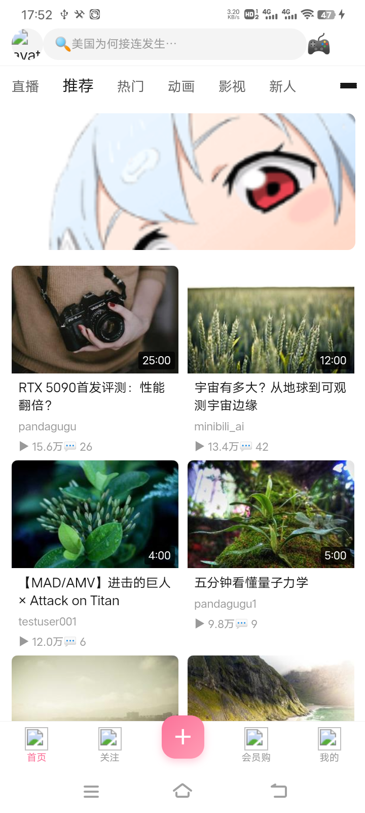

# Cakecake 移动端 App 文档

> 移动端客户端（uni-app + Vue3 + TS），复用 Cakecake Go 后端 180+ 端点。
> 版本：**v0.1.0**（2026-08-20 云打包发布，GitHub Release：`PandaGuGu/Copy` tag `v0.1.0`）

## 技术栈

| 项 | 选择 |
|----|------|
| 框架 | uni-app + Vue 3 + TypeScript + Vite（CLI 工程） |
| 状态 | Pinia |
| UI | uni-ui + 自定义组件，主色 `#FB7299`（B 站粉） |
| 网络 | axios + JWT 401 自动刷新 + `{code,msg,data}` 信封 |
| 工程路径 | `cakecake-vue/cakecake-app/` |

## 页面结构

- **4 个 tab**：首页 / 关注 / 会员购 / 我的（中间 midButton 发布器，`navigateTo` 跳发布页）
- **19 个二级页面**：分类 / 分区 / 发布 / 视频详情 / 搜索 / 登录 / 我的视频 / 个人空间 / 通知 / 我的动态 / 私信 / 私信聊天 / 直播间 / 收藏 / 浏览历史 等

## 启动与构建

```bash
cd cakecake-vue/cakecake-app
npm install                 # 依赖已锁 npmmirror 镜像，~1 分钟
npm run dev:h5              # H5 开发（默认 5173，占用自动顺延）
npm run build:h5            # H5 构建 → dist/build/h5/
npm run build:app           # App 构建 → dist/build/app/（www 资源）
```

## 后端地址机制

- App 端无 vite 代理，直连后端必须用 `VITE_API_BASE_URL_APP`（电脑局域网 IP，如 `http://192.168.1.100:8080`）
- **铁律（S-020）**：任何直连地址（video src / fetch / uploadFile / 自拼 URL）都必须 `#ifdef APP-PLUS` 条件编译——App 用 `VITE_API_BASE_URL_APP`，H5 用 `VITE_API_BASE_URL || 'http://127.0.0.1:8080'`（H5 dev 的 fallback 严禁删）
- 反例：video-detail 曾直接拼 `VITE_API_BASE_URL`（App 打包=127.0.0.1）→ 真机视频黑屏只有播放按钮；user.ts/upload.ts 同类 → 发动态/上传必失败（均已修，2026-08-20）

| 场景 | 配置 | 说明 |
|------|------|------|
| H5 dev | `VITE_API_BASE_URL=` 空 | axios 相对路径 `/api/` → vite dev 代理 → `VITE_PROXY_TARGET=http://127.0.0.1:8080` |
| App 原生 | `VITE_API_BASE_URL_APP=http://192.168.1.100:8080` | 电脑局域网 IP，真机经此访问 |
| 真机 H5 | 访问 `http://<电脑IP>:5173` | 一个地址全通（走 vite 代理） |

## 真机部署（HBuilderX 基座，CLI 构建 + adb push）

1. `npm run build:app`（~27s）→ `dist/build/app/`
2. 基座资源目录：`/sdcard/Android/data/io.dcloud.HBuilder/apps/__UNI__30895C4/www/`
3. 备份旧资源：`adb shell "cd <dir> && mv www www.bak && mkdir -p www"`
4. 推送：`adb push dist/build/app/. <dir>/www/`（必须绝对路径）
5. 启动：`adb shell am force-stop io.dcloud.HBuilder` + `monkey -p io.dcloud.HBuilder -c android.intent.category.LAUNCHER 1`，等 15s
6. `screencap + pull` 验证

**云打包**（发布 APK）：`D:/HBuilderX/HBuilderX/cli.exe pack --project <cakecake-app> --platform android --android.packagename com.cakecake.app --android.androidpacktype 3`
（`androidpacktype`：1 公共证书已停用，**3 云端证书**可用；再次打包加 `--safemode true` 走安心打包不占次数）

## 界面截图

真机首页（720x1600，修复后）：状态栏 → 导航栏 → tab → banner → 双列视频网格（有数据）。



## 弹幕播放器（2026-08-20 落地，双端原生/WebView 分流）

- **双端实现**：`src/pages/video-detail/` 下同名 `index.vue`（H5/WebView，canvas 弹幕）+ `index.nvue`（**App 端客户端原生渲染**，weex 引擎）——uni-app 同名 .vue/.nvue 并存时 App 自动优先 .nvue，H5 用 .vue，零路由改动
- **nvue 版弹幕**：不用 canvas（nvue canvas API 差异大），改**原生 view 节点模拟**——每条弹幕一个绝对定位 view，`translateX` 移动，30fps 定时器消费时间轴；原生控件渲染性能优于 WebView canvas
- **nvue 版状态栏**：全局 SCSS 的 `var(--status-bar-height)` 在 nvue 无效（编译警告来源），navbar 必须显式 `paddingTop: getSystemInfoSync().statusBarHeight`；全屏时 `plus.navigator.setFullscreen(true)` 隐藏状态栏、退出恢复
- **nvue 版评论**：两层结构（顶层+回复展开），已含 UP 主置顶/精选操作
- **后端**：`GET /api/v1/videos/:id/danmaku?limit=&offset=` 按 `video_time ASC` 返回时间轴（`ListDanmakus`）；发送沿用既有 `POST .../danmaku`（S-007 冷却 + S-014 颜色 + 敏感词 + 可选 AI 审核）
- **应用内全屏**：不调系统播放器全屏；容器 `fixed` 铺满 + 锁横屏——App(nvue) 走 `plus.screen.lockOrientation('landscape-primary')`，H5 走 `requestFullscreen()` → `screen.orientation.lock('landscape')`（需全屏上下文）；**切勿用 CSS rotate(90deg) 容器做横屏**（文字竖排，实测踩坑）；物理返回键先退全屏
- **回归验证**：H5 用 `cakecake-app/dm-verify.cjs`（playwright + PIL 像素分析）；App 端 nvue 编译产物验证 `grep -c canvas` = 0（nvue 无 canvas）+ `dm-item` 存在；真机横屏需 HBuilderX 基座实测
- **遗留**：nvue 版评论为简化两层结构（无 UP主置顶/精选按钮）；弹幕 WS 实时订阅未做（REST 时间轴 + 发送后本地上屏）

## Backlog

- 移动端专属 API：分片上传 / 推送注册 / 商品下单
- 弹幕 WS 实时订阅（当前 H5 无 WS 弹幕，靠 REST 时间轴 + 发送后本地上屏）
- nvue 版评论区补 UP主操作（置顶/精选）
- 公网通道恢复（当前仅局域网可用，见 `bmad-output/architecture.md` §10）
- 专业设计稿替换占位图标（当前 TabBar 图标为 PIL 生成）

## 相关文档

- 架构：`bmad-output/architecture.md` §12 移动端架构（MD-ADR-001~003）
- 后端 API：`docs/API.md`
- 开发日志：`.workbuddy/memory/2026-08-16.md`、`2026-08-17.md`、`2026-08-20.md`
